# Chuyển đổi DA-GWO → Bộ giải Tối ưu Vận chuyển HMA


> [!CAUTION]
> ### Sự khác biệt quan trọng so với bản phân tích trước
> | Điểm | Bản trước (dự đoán) | Tài liệu thực tế |
> |---|---|---|
> | **Mô hình nhiệt độ** | Newton's exponential cooling: `T(t) = T_env + (T_init-T_env)·e^(-kt)` | **Tuyến tính**: `T_ikm = To - 0.5 × (doi / v)×60 |
> | **Hàm phạt** | Quadratic penalty: `λ × violation²` | **Step function nhị phân**: `F(T) = 0 nếu T≥120°C, Q×α nếu T<120°C` |
> | **Đội xe** | Heterogeneous (mỗi xe capacity khác nhau) | **Homogeneous**: tất cả xe cùng tải trọng Q |
> | **Chi phí vận hành** | `fuel_rate × distance × fuel_price` | `2 × doi × coi × xikm` (đơn giản hơn) |
> | **Chi phí cố định** | `FC[i]` mỗi xe khác nhau | `f × zk` — đơn giá `f` chung cho mọi xe |
> | **Ràng buộc nhu cầu** | `delivered ≥ demand` (bất đẳng thức) | `Σ xikm = ⌈Di/Q⌉` (đẳng thức chính xác) |

---

## Hệ thống Tham số và Biến số (từ tài liệu)

### Tham số đầu vào

| Ký hiệu | Ý nghĩa | Ví dụ |
|---|---|---|
| `N` | Số công trường cần phục vụ | 3 |
| `T` | Số phương tiện trong đội xe | 5 |
| `Mk` | Số chuyến tối đa của xe k trong 1 ca | 6 |
| `f` | Đơn giá chi phí cố định (VNĐ/xe) | 2,000,000 |
| `coi` | Đơn giá vận hành (VNĐ/km) | 15,000 |
| `doi` | Khoảng cách 1 chiều từ trạm trộn đến công trường i (km) | 25 |
| `Q` | Tải trọng định mức (tấn/chuyến) | 12.5 |
| `Di` | Nhu cầu HMA tại công trường i (tấn) | 150 |
| `To` | Nhiệt độ HMA khi rời trạm trộn (°C) | 160 |
| `α` | Hệ số phạt khi nhiệt độ < 120°C (VNĐ/tấn) | 500,000 |
| `v` | Vận tốc trung bình (km/h) | 40 |
| `Δtdo` | Thời gian đổ vật liệu tại hiện trường (phút) | 30 |

### Biến quyết định

| Ký hiệu | Loại | Ý nghĩa |
|---|---|---|
| `zk` | Nhị phân {0,1} | Xe k có được huy động không? |
| `xikm` | Nhị phân {0,1} | Chuyến m của xe k có đến công trường i không? |
| `txp_km` | Liên tục ≥ 0 | Thời điểm chuyến m của xe k rời trạm trộn (phút) |

---

## BƯỚC 1: Phân tích thuật toán DA_GWO hiện tại

### 1.1. Search Agent là gì?

Trong code hiện tại, **Search Agent** = 1 cá thể trong quần thể = 1 ứng viên lời giải.

| Thuộc tính | Vị trí trong code | Ý nghĩa hiện tại | **Ý nghĩa trong HMA** |
|---|---|---|---|
| Tổng agents | `SearchAgents_no` ([DA_GWO.java:58](file:///d:/DA_GWO/src/com/test/DA_GWO.java#L58)) | 40 con sói/chuồn chuồn | 40 **phương án vận chuyển** |
| Vị trí agent i | `X[i][j]` ([DA_GWO.java:62](file:///d:/DA_GWO/src/com/test/DA_GWO.java#L62)) | Vector ℝ^dim | Vector mã hóa `zk`, `xikm`, `txp_km` |
| Fitness agent i | `Fitness[i]` ([DA_GWO.java:76](file:///d:/DA_GWO/src/com/test/DA_GWO.java#L76)) | f(x) benchmark | **TC** = C_fixed + C_oper + C_penalty |

### 1.2. Position Vector đang biểu diễn cái gì?

```
HIỆN TẠI: X[i] = [x₁, x₂, ..., x_dim] ∈ ℝ^dim  (vector liên tục, ý nghĩa toán học thuần túy)
SẼ LÀ:    X[i] = [z₁..zT | x₁₁₁..xNTM | txp₁₁..txpTM]  (mã hóa phương án vận chuyển HMA)
```

### 1.3. Fitness Function hiện tại

- **Interface**: [f_xj.java:6](file:///d:/DA_GWO/src/com/test/f_xj.java#L6) — `abstract double func(double x[])`
- **Implementation**: [f_test.java:176-521](file:///d:/DA_GWO/src/com/test/f_test.java#L176-L521) — 23 hàm benchmark F1-F23
- **Gọi tại**: [DA_GWO.java:151](file:///d:/DA_GWO/src/com/test/DA_GWO.java#L151) — `Fitness[i] = fobj.func(X[i])`

### 1.4. Nơi gọi benchmark F1-F23

| Nơi | File:Dòng | Mục đích |
|---|---|---|
| Định nghĩa 23 hàm | [f_test.java:176-521](file:///d:/DA_GWO/src/com/test/f_test.java#L176-L521) | Inner class `f1..f23` |
| Chọn hàm | [f_test.java:11-153](file:///d:/DA_GWO/src/com/test/f_test.java#L11-L153) | `getFunctionDetail()` |
| Gọi trong thuật toán | [DA_GWO.java:151](file:///d:/DA_GWO/src/com/test/DA_GWO.java#L151), [408](file:///d:/DA_GWO/src/com/test/DA_GWO.java#L408), [502](file:///d:/DA_GWO/src/com/test/DA_GWO.java#L502) | `fobj.func(X[i])` |

### 1.5. File đánh giá fitness

| File | Vai trò |
|---|---|
| [f_xj.java](file:///d:/DA_GWO/src/com/test/f_xj.java) | Interface trừu tượng |
| [f_test.java](file:///d:/DA_GWO/src/com/test/f_test.java) | 23 implementation benchmark |
| [DA_GWO.java](file:///d:/DA_GWO/src/com/test/DA_GWO.java) | Caller — gọi `fobj.func()` |

### 1.6. File cập nhật nghiệm

Duy nhất [DA_GWO.java](file:///d:/DA_GWO/src/com/test/DA_GWO.java):

| Phần | Dòng |
|---|---|
| GWO cập nhật X_GWO | [171-196](file:///d:/DA_GWO/src/com/test/DA_GWO.java#L171-L196) |
| DA cập nhật X_DA | [231-374](file:///d:/DA_GWO/src/com/test/DA_GWO.java#L231-L374) |
| Gộp quần thể | [378-387](file:///d:/DA_GWO/src/com/test/DA_GWO.java#L378-L387) |
| Kiểm tra biên | [389](file:///d:/DA_GWO/src/com/test/DA_GWO.java#L389) — `simplebounds()` |
| Sắp xếp | [390](file:///d:/DA_GWO/src/com/test/DA_GWO.java#L390) — `sort_and_index()` |

### 1.7. Luồng chạy

```
testt.main()
  ├── f_test.getFunctionDetail("f23")
  ├── new DA_GWO(f23, lb, ub, 300, 40)
  └── DA_GWO.solution()
       ├── init(): X[40][4] random, sort, gán alfa/beta/delta
       └── FOR iter = 1→300:
            ├── CHIA: X_GWO=X[0..19], X_DA=X[20..39]
            ├── FITNESS: Fitness[i] = f23(X[i])
            ├── GWO: X_GWO[i][j] = (X1+X2+X3)/3
            ├── DA: 5 hành vi + Lévy flight
            ├── GỘP: X = [X_GWO | X_DA]
            ├── simplebounds() + sort_and_index()
            └── Best_score = f(X[0])
```

---

## BƯỚC 2: File cần sửa

### Tổng quan

| Hành động | File | Lý do |
|---|---|---|
| **BỎ** | [f_test.java](file:///d:/DA_GWO/src/com/test/f_test.java) | 23 hàm benchmark không dùng nữa |
| **GIỮ NGUYÊN** | [f_xj.java](file:///d:/DA_GWO/src/com/test/f_xj.java) | Interface `func(double[])` vẫn tương thích |
| **SỬA** | [DA_GWO.java](file:///d:/DA_GWO/src/com/test/DA_GWO.java) | Thay encoding, init, bounds, repair |
| **SỬA** | [testt.java](file:///d:/DA_GWO/src/com/test/testt.java) | Thay runner |
| **SỬA** | [ExcelUtils.java](file:///d:/DA_GWO/src/com/test/ExcelUtils.java) | Xuất phương án vận chuyển |
| **TẠO MỚI** | `HMAFitness.java` | TC = C_fixed + C_oper + C_penalty (Eq.1-5) |
| **TẠO MỚI** | `HMAConfig.java` | Tham số bài toán |
| **TẠO MỚI** | `HMASolution.java` | Decode vector → phương án |
| **TẠO MỚI** | `ConstraintHandler.java` | Ràng buộc (6)-(11) |

### Chi tiết từng sửa đổi

#### [DA_GWO.java](file:///d:/DA_GWO/src/com/test/DA_GWO.java) 

| Hàm | Dòng | Sửa gì | Lý do |
|---|---|---|---|
| Constructor | [54-87](file:///d:/DA_GWO/src/com/test/DA_GWO.java#L54-L87) | `dim` = T + N×T×M_max + T×M_max | Dimension mới theo encoding HMA |
| `init()` | [89-122](file:///d:/DA_GWO/src/com/test/DA_GWO.java#L89-L122) | Thay random [lb,ub] bằng random [0,1] + repair | Khởi tạo nghiệm HMA hợp lệ |
| `solution()` dòng 151 | [151](file:///d:/DA_GWO/src/com/test/DA_GWO.java#L151) | `fobj.func(X[i])` giờ gọi `HMAFitness` | Tính TC thay vì benchmark |
| `simplebounds()` | [541-554](file:///d:/DA_GWO/src/com/test/DA_GWO.java#L541-L554) | Thay bằng `repairSolution()` | Clip [lb,ub] không đủ — cần repair ràng buộc HMA |
| `sort_and_index()` | [498-539](file:///d:/DA_GWO/src/com/test/DA_GWO.java#L498-L539) | Giữ logic, cache fitness | `fobj.func()` giờ tính TC (nặng hơn) |
| Sau vòng lặp | [408-419](file:///d:/DA_GWO/src/com/test/DA_GWO.java#L408-L419) | Trích xuất + in phương án vận chuyển | Không chỉ in Best_score |

#### [testt.java](file:///d:/DA_GWO/src/com/test/testt.java) — SỬA

| Dòng | Sửa | Lý do |
|---|---|---|
| [8-13](file:///d:/DA_GWO/src/com/test/testt.java#L8-L13) | `HMA_res[30]` thay `GWO_res[23][30]` | 1 bài toán HMA, không 23 benchmark |
| [15-21](file:///d:/DA_GWO/src/com/test/testt.java#L15-L21) | `main()` chạy HMA | Truyền `HMAFitness` thay `f_test.getF()` |
| [86-116](file:///d:/DA_GWO/src/com/test/testt.java#L86-L116) | `DA_GWO()` nhận `HMAConfig` | Thay đổi input |

---

## BƯỚC 3: Thiết kế Encoding

### 3.1. Biến quyết định theo tài liệu

Từ PDF, có 3 nhóm biến:

| Biến | Loại | Kích thước | Ý nghĩa |
|---|---|---|---|
| `zk` | Binary {0,1} | T | Xe k có huy động không? |
| `xikm` | Binary {0,1} | N × T × M_max | Chuyến m xe k đến công trường i? |
| `txp_km` | Continuous ≥ 0 | T × M_max | Thời điểm xuất phát (phút) |

### 3.2. Priority-Based Continuous Encoding

Vì DA-GWO hoạt động trên **không gian liên tục**, ta mã hóa tất cả biến vào vector `X[i] ∈ [0,1]^dim`:

```
X[i] = [ z_part | x_part | t_part ]
         T elem   N×T×M    T×M elem
```

**dim = T + N×T×M_max + T×M_max**

Ví dụ: T=5 xe, N=3 công trường, M_max=6 chuyến:
- dim = 5 + 3×5×6 + 5×6 = 5 + 90 + 30 = **125**

#### Phần 1: Vehicle activation `z_part` (T phần tử)

```
X[0..T-1] = [0.82, 0.15, 0.67, 0.43, 0.91]
```
- **Decode**: `zk = (X[k] ≥ 0.5) ? 1 : 0`
- Ví dụ: xe 1 (0.82≥0.5→dùng), xe 2 (0.15<0.5→không dùng)
- **DA-GWO tự tối ưu:** giá trị gần 0 hoặc gần 1 → quyết định rõ ràng

#### Phần 2: Trip-site assignment `x_part` (N×T×M_max phần tử)

```
X[T .. T+N*T*M-1] = [0.23, 0.78, 0.12, ...]
```
- Index: `offset = T + (i*T*M + k*M + m)` → `xikm`
- **Decode**: Với mỗi cặp (k,m), tìm `i_max = argmax_i { X[offset(i,k,m)] }` → chuyến m xe k đến công trường `i_max`
- Đảm bảo ràng buộc (7): mỗi chuyến chỉ đến 1 công trường (argmax tự động thỏa)
- Nếu `max value < threshold` → chuyến m không được thực hiện

#### Phần 3: Departure times `t_part` (T×M_max phần tử)

```
X[T+N*T*M .. dim-1] = [0.31, 0.55, 0.12, ...]
```
- Index: `offset = T + N*T*M + k*M + m`
- **Decode**: `txp_km = X[offset] × T_ca` (T_ca = tổng thời gian ca làm việc, phút)
- Ví dụ: ca 8 giờ = 480 phút, X=0.31 → txp = 0.31 × 480 = 148.8 phút

### 3.3. Thuật toán Decode hoàn chỉnh

```java
public HMASolution decode(double[] X, HMAConfig cfg) {
    HMASolution sol = new HMASolution(cfg);
    
    // 1. Decode zk (xe nào được huy động)
    for (int k = 0; k < cfg.T; k++) {
        sol.zk[k] = (X[k] >= 0.5) ? 1 : 0;
    }
    
    // 2. Decode xikm (chuyến m xe k đi công trường nào)
    int xOffset = cfg.T;
    for (int k = 0; k < cfg.T; k++) {
        if (sol.zk[k] == 0) continue; // xe không dùng → skip
        for (int m = 0; m < cfg.Mk; m++) {
            double maxVal = -1;
            int bestSite = -1;
            for (int i = 0; i < cfg.N; i++) {
                int idx = xOffset + i * cfg.T * cfg.Mk + k * cfg.Mk + m;
                if (X[idx] > maxVal) {
                    maxVal = X[idx];
                    bestSite = i;
                }
            }
            if (maxVal >= 0.3) { // threshold: chuyến được kích hoạt
                sol.xikm[bestSite][k][m] = 1;
            }
        }
    }
    
    // 3. Decode txp_km (thời điểm xuất phát)
    int tOffset = cfg.T + cfg.N * cfg.T * cfg.Mk;
    for (int k = 0; k < cfg.T; k++) {
        for (int m = 0; m < cfg.Mk; m++) {
            int idx = tOffset + k * cfg.Mk + m;
            sol.txp_km[k][m] = X[idx] * cfg.T_ca; // ánh xạ [0,1] → [0, T_ca] phút
        }
    }
    
    // 4. Sắp xếp txp_km tăng dần cho mỗi xe
    for (int k = 0; k < cfg.T; k++) {
        sortTripsChronologically(sol, k);
    }
    
    return sol;
}
```

### 3.4. Vì sao encoding này phù hợp?

| Tiêu chí | Giải thích cụ thể cho HMA |
|---|---|
| **Tương thích DA-GWO** | Vector [0,1]^dim → GWO/DA hoạt động bình thường trên không gian liên tục |
| **Binary mapping** | `zk = (X[k]≥0.5)?1:0` — DA-GWO tự đẩy giá trị về 0 hoặc 1 qua quá trình tối ưu |
| **Argmax cho site** | `xikm = argmax_i` — tự động thỏa ràng buộc (7): mỗi chuyến chỉ đến 1 site |
| **Continuous time** | `txp_km = X[j] × T_ca` — mapping tự nhiên từ [0,1] sang phút |
| **Cấu trúc lân cận** | Vector gần nhau → phương án tương tự → landscape mượt |
| **Repair dễ** | Clip về [0,1] luôn decode được → repair constraints sau |

---

## BƯỚC 4: Thay thế Fitness Function 

### 4.1. Hàm mục tiêu — Eq. (1)

```
min TC = C_fixed + C_operational + C_penalty
```

### 4.2. C_fixed — Eq. (2)

```
C_fixed = Σ(k=1..T) f × zk
```

- `f` = đơn giá cố định (VNĐ/xe) — **CHUNG cho mọi xe**
- `zk` = 1 nếu xe k huy động, 0 nếu không
- **Ý nghĩa HMA**: Mỗi xe ben huy động → tốn chi phí cố định (lương tài xế, khấu hao). Dùng ít xe → giảm C_fixed.

```java
double calcCfixed(HMASolution sol, HMAConfig cfg) {
    double Cfixed = 0;
    for (int k = 0; k < cfg.T; k++) {
        Cfixed += cfg.f * sol.zk[k];
    }
    return Cfixed;
}
```

### 4.3. C_operational — Eq. (3)

```
C_operational = Σ(k=1..T) Σ(i=1..N) Σ(m=1..Mk) 2 × doi × coi × xikm
```

- `2 × doi` = quãng đường khứ hồi (đi + về)
- `coi` = đơn giá vận hành (VNĐ/km) — **theo công trường i**
- `xikm` = 1 nếu chuyến m xe k đến site i
- **Ý nghĩa HMA**: Chi phí nhiên liệu + hao mòn cho mỗi chuyến. Công trường xa → chi phí cao hơn.

```java
double calcCoperational(HMASolution sol, HMAConfig cfg) {
    double Coper = 0;
    for (int k = 0; k < cfg.T; k++) {
        for (int i = 0; i < cfg.N; i++) {
            for (int m = 0; m < cfg.Mk; m++) {
                Coper += 2 * cfg.doi[i] * cfg.coi[i] * sol.xikm[i][k][m];
            }
        }
    }
    return Coper;
}
```

### 4.4. C_penalty — Eq. (4) + (5)

```
C_penalty = Σ(k=1..T) Σ(i=1..N) Σ(m=1..Mk) F(Tikm) × xikm
```

Với hàm phạt nhiệt độ — Eq. (5):

```
F(Tikm) = { 0         khi Tikm ≥ 120°C
           { Q × α     khi Tikm < 120°C
```

- **NHỊ PHÂN** — không phải quadratic! Hoặc phạt `Q×α`, hoặc không phạt.
- `Q` = tải trọng (tấn), `α` = hệ số phạt (VNĐ/tấn)
- **Ý nghĩa HMA**: HMA nguội dưới 120°C → **toàn bộ chuyến** bị phạt (không thể thi công → bỏ cả xe HMA)

```java
double calcCpenalty(HMASolution sol, HMAConfig cfg) {
    double Cpenalty = 0;
    for (int k = 0; k < cfg.T; k++) {
        for (int i = 0; i < cfg.N; i++) {
            for (int m = 0; m < cfg.Mk; m++) {
                if (sol.xikm[i][k][m] == 1) {
                    double Tikm = calcTemperature(i, k, m, sol, cfg); // Eq. (9)
                    double F_Tikm;
                    if (Tikm >= 120.0) {
                        F_Tikm = 0;        // OK — đủ nóng
                    } else {
                        F_Tikm = cfg.Q * cfg.alpha; // PHẠT — HMA nguội
                    }
                    Cpenalty += F_Tikm;  // đã nhân xikm=1 ở điều kiện if
                }
            }
        }
    }
    return Cpenalty;
}
```

### 4.5. Nhiệt độ HMA — Eq. (9)

```
Tikm = To - 0.5 × (doi / (v × 60))
```

> [!WARNING]
> Công thức này là **TUYẾN TÍNH** — không phải exponential Newton's cooling!
> - `To` = nhiệt độ xuất xưởng (°C)
> - `doi` = khoảng cách 1 chiều (km)  
> - `v` = vận tốc (km/h)
> - `doi / (v × 60)` = thời gian di chuyển tính bằng phần của giờ, nhân 60 = phút? 
>
> **Chú ý**: `doi/(v×60)` có đơn vị km/(km/h × 60) = 1/60 giờ. Vậy `0.5 × doi/(v×60)` là hệ số suy giảm nhiệt. Với doi=25km, v=40km/h: `T = To - 0.5 × 25/(40×60) = To - 0.0052°C` → suy giảm rất ít. Cần xác nhận đơn vị với bạn.

```java
double calcTemperature(int i, int k, int m, HMASolution sol, HMAConfig cfg) {
    // Eq. (9): Tikm = To - 0.5 × (doi / (v × 60))
    return cfg.To - 0.5 * (cfg.doi[i] / (cfg.v * 60.0));
}
```

---

## BƯỚC 5: Hàm evaluateSolution()

```java
public class HMAFitness extends f_xj {
    
    private HMAConfig cfg;
    
    public HMAFitness(HMAConfig cfg) {
        this.cfg = cfg;
    }
    
    @Override
    public double func(double[] X) throws IOException {
        // ═══════════════════════════════════════════
        // PHASE 1: DECODE vector → Solution
        // ═══════════════════════════════════════════
        HMASolution sol = decode(X, cfg);
        
        // ═══════════════════════════════════════════
        // PHASE 2: REPAIR — đảm bảo ràng buộc cứng
        // ═══════════════════════════════════════════
        repairSolution(sol, cfg);
        
        // ═══════════════════════════════════════════
        // PHASE 3: TÍNH C_fixed — Eq. (2)
        // ═══════════════════════════════════════════
        // C_fixed = Σ(k=1..T) f × zk
        double Cfixed = 0;
        for (int k = 0; k < cfg.T; k++) {
            Cfixed += cfg.f * sol.zk[k];
        }
        
        // ═══════════════════════════════════════════
        // PHASE 4: TÍNH C_operational — Eq. (3)
        // ═══════════════════════════════════════════
        // C_oper = Σ_k Σ_i Σ_m 2 × doi × coi × xikm
        double Coper = 0;
        for (int k = 0; k < cfg.T; k++) {
            for (int i = 0; i < cfg.N; i++) {
                for (int m = 0; m < cfg.Mk; m++) {
                    Coper += 2.0 * cfg.doi[i] * cfg.coi[i] * sol.xikm[i][k][m];
                }
            }
        }
        
        // ═══════════════════════════════════════════
        // PHASE 5: TÍNH C_penalty — Eq. (4) + (5)
        // ═══════════════════════════════════════════
        // Cần tính Tikm theo Eq. (9) trước
        double Cpenalty = 0;
        for (int k = 0; k < cfg.T; k++) {
            for (int i = 0; i < cfg.N; i++) {
                for (int m = 0; m < cfg.Mk; m++) {
                    if (sol.xikm[i][k][m] == 1) {
                        // Eq. (9): Tikm = To - 0.5 × (doi / (v × 60))
                        double Tikm = cfg.To - 0.5 * (cfg.doi[i] / (cfg.v * 60.0));
                        
                        // Eq. (5): Hàm phạt nhị phân
                        double F_Tikm;
                        if (Tikm >= 120.0) {
                            F_Tikm = 0;              // Nhiệt độ OK
                        } else {
                            F_Tikm = cfg.Q * cfg.alpha; // HMA nguội → phạt
                        }
                        Cpenalty += F_Tikm;
                    }
                }
            }
        }
        
        // ═══════════════════════════════════════════
        // PHASE 6: PENALTY BỔ SUNG cho ràng buộc mềm
        // ═══════════════════════════════════════════
        // Nếu repair chưa hoàn toàn sửa được ràng buộc (6),(7),(8)
        // thêm penalty bổ sung để thuật toán tránh
        double extraPenalty = calcExtraPenalty(sol, cfg);
        
        // ═══════════════════════════════════════════
        // PHASE 7: TỔNG — Eq. (1)
        // ═══════════════════════════════════════════
        double TC = Cfixed + Coper + Cpenalty + extraPenalty;
        
        return TC;
    }
    
    /**
     * Penalty bổ sung cho ràng buộc chưa repair được hoàn toàn
     */
    private double calcExtraPenalty(HMASolution sol, HMAConfig cfg) {
        double penalty = 0;
        double LAMBDA = 1000000; // Hệ số phạt lớn
        
        // Ràng buộc (6): Nhu cầu chưa đủ
        for (int i = 0; i < cfg.N; i++) {
            int required = (int) Math.ceil(cfg.Di[i] / cfg.Q);
            int actual = 0;
            for (int k = 0; k < cfg.T; k++) {
                for (int m = 0; m < cfg.Mk; m++) {
                    actual += sol.xikm[i][k][m];
                }
            }
            if (actual != required) {
                penalty += LAMBDA * Math.pow(actual - required, 2);
            }
        }
        
        // Ràng buộc (8): Vi phạm thời gian tuần tự
        for (int k = 0; k < cfg.T; k++) {
            for (int m = 0; m < cfg.Mk - 1; m++) {
                // Tìm site mà chuyến m đi đến
                int siteM = -1;
                for (int i = 0; i < cfg.N; i++) {
                    if (sol.xikm[i][k][m] == 1) { siteM = i; break; }
                }
                if (siteM == -1) continue;
                
                double roundTripTime = (2.0 * cfg.doi[siteM] / cfg.v) * 60.0 + cfg.dtdo;
                double earliestNext = sol.txp_km[k][m] + roundTripTime;
                
                if (sol.txp_km[k][m + 1] < earliestNext && hasTrip(sol, k, m + 1, cfg)) {
                    double violation = earliestNext - sol.txp_km[k][m + 1];
                    penalty += LAMBDA * violation * violation;
                }
            }
        }
        
        return penalty;
    }
}
```

---

## BƯỚC 6: Constraint Handling (Theo đúng Eq. 6-11 trong PDF)

### Ràng buộc (6) — Toàn vẹn nhu cầu

```
Σ(k=1..T) Σ(m=1..Mk) xikm = ⌈Di/Q⌉     ∀i ∈ {1,..,N}
```

> **Ý nghĩa**: Tổng số chuyến giao đến công trường i phải **ĐÚNG BẰNG** `⌈Di/Q⌉` (làm tròn lên). Ví dụ: nhu cầu 150 tấn, Q=12.5 tấn → cần đúng 12 chuyến.

| Cách xử lý | Chi tiết |
|---|---|
| **Kiểm tra** | Đếm `actual_trips[i] = Σ_k Σ_m xikm`, so với `⌈Di/Q⌉` |
| **Repair** | Nếu thiếu → thêm chuyến cho xe còn capacity. Nếu thừa → bỏ chuyến xa nhất |
| **Penalty** | `LAMBDA × (actual - required)²` — phạt cả thiếu lẫn thừa |

```java
void repairDemand(HMASolution sol, HMAConfig cfg) {
    for (int i = 0; i < cfg.N; i++) {
        int required = (int) Math.ceil(cfg.Di[i] / cfg.Q);
        int actual = countTripsToSite(sol, i, cfg);
        
        // Thừa → bỏ chuyến
        while (actual > required) {
            removeLastTripToSite(sol, i, cfg);
            actual--;
        }
        // Thiếu → thêm chuyến
        while (actual < required) {
            addTripToSite(sol, i, cfg); // gán cho xe còn slot trống
            actual++;
        }
    }
}
```

---

### Ràng buộc (7) — Giới hạn chuyến đi

```
Σ(i=1..N) xikm ≤ 1     ∀k, ∀m
```

> **Ý nghĩa**: Mỗi chuyến m của xe k chỉ đến **tối đa 1** công trường. (Xe không thể tách chuyến đi 2 nơi cùng lúc)

| Cách xử lý | Chi tiết |
|---|---|
| **Tự thỏa bởi encoding** | Decode dùng `argmax_i` → tự động chỉ chọn 1 site cho mỗi (k,m) |
| **Repair** | Nếu vi phạm (do lỗi): giữ site có giá trị X cao nhất, set còn lại = 0 |
| **Penalty** | Không cần — encoding đảm bảo |

```java
// Đã được đảm bảo trong decode:
// bestSite = argmax_i { X[offset(i,k,m)] }
// → chỉ set sol.xikm[bestSite][k][m] = 1, còn lại = 0
```

---

### Ràng buộc (8) — Thời gian tuần tự

```
txp_km+1 ≥ txp_km + Σ(i=1..N) [ (2×doi/v)×60 + Δtdo ] × xikm
```

> **Ý nghĩa**: Chuyến tiếp theo phải xuất phát SAU KHI xe hoàn thành chuyến hiện tại. Thời gian 1 chuyến = `(2×doi/v)×60 + Δtdo` phút = thời gian đi-về + thời gian đổ.

| Cách xử lý | Chi tiết |
|---|---|
| **Kiểm tra** | Tính `return_time[k][m]`, kiểm tra `txp[k][m+1] ≥ return_time[k][m]` |
| **Repair (BẮT BUỘC)** | Đẩy `txp[k][m+1] = max(txp[k][m+1], return_time[k][m])` |
| **Penalty** | Bổ sung `LAMBDA × overlap²` nếu repair chưa đủ |

```java
void repairSequence(HMASolution sol, HMAConfig cfg) {
    for (int k = 0; k < cfg.T; k++) {
        // Sắp xếp chuyến theo thời gian
        sortTripsByTime(sol, k);
        
        for (int m = 0; m < cfg.Mk - 1; m++) {
            // Tìm site chuyến m
            int site = getSiteForTrip(sol, k, m, cfg);
            if (site == -1) continue;
            
            // Thời gian hoàn thành chuyến m (phút)
            // = txp_km + (2 × doi / v) × 60 + Δtdo
            double roundTripMinutes = (2.0 * cfg.doi[site] / cfg.v) * 60.0 + cfg.dtdo;
            double returnTime = sol.txp_km[k][m] + roundTripMinutes;
            
            // Chuyến m+1 phải sau return
            if (sol.txp_km[k][m + 1] < returnTime) {
                sol.txp_km[k][m + 1] = returnTime;
            }
        }
    }
}
```

---

### Ràng buộc (9) — Suy giảm nhiệt độ

```
Tikm = To - 0.5 × (doi / (v × 60))
```

> **Ý nghĩa**: Nhiệt độ HMA giảm tuyến tính theo khoảng cách/thời gian vận chuyển. Công trường càng xa → HMA càng nguội.

| Cách xử lý | Chi tiết |
|---|---|
| **Tính toán** | Đây là **công thức tính**, không phải ràng buộc cần repair |
| **Ảnh hưởng** | Nếu `Tikm < 120°C` → kích hoạt F(Tikm) = Q×α trong C_penalty |
| **Gián tiếp** | Thuật toán sẽ tự tránh gán xe đến công trường quá xa (vì phạt cao) |

```java
// Không cần repair — đây là công thức vật lý
// Chỉ cần tính chính xác trong evaluateSolution()
double Tikm = cfg.To - 0.5 * (cfg.doi[i] / (cfg.v * 60.0));
```

---

### Ràng buộc (10) — Miền biến nhị phân

```
zk, xikm ∈ {0, 1}     ∀i, k, m
```

> **Ý nghĩa**: Các biến quyết định là nhị phân — xe hoặc được dùng hoặc không, chuyến hoặc đi hoặc không.

| Cách xử lý | Chi tiết |
|---|---|
| **Encoding** | Decode: `zk = (X[k] ≥ 0.5) ? 1 : 0` — tự động nhị phân |
| **Repair** | Không cần — decode luôn tạo binary |

---

### Ràng buộc (11) — Thời gian không âm

```
txp_km ≥ 0     ∀k, m
```

> **Ý nghĩa**: Thời điểm xuất phát không thể âm.

| Cách xử lý | Chi tiết |
|---|---|
| **Encoding** | Decode: `txp_km = X[j] × T_ca` với `X[j] ∈ [0,1]` → `txp_km ∈ [0, T_ca]` → luôn ≥ 0 |
| **Repair** | `txp_km = Math.max(txp_km, 0)` — clip nếu cần |

---

### Tổng hợp thứ tự Repair

```
1. repairBounds()       → Clip X về [0,1], đảm bảo (10),(11)
2. decode()             → Tạo sol từ X (tự thỏa (7) nhờ argmax)
3. repairSequence()     → Đảm bảo (8): xe quay về trước chuyến tiếp
4. repairDemand()       → Đảm bảo (6): đủ số chuyến cho mỗi site
5. calcFitness()        → Tính TC, bao gồm (9) → F(T) penalty nếu T<120°C
6. extraPenalty()       → Penalty bổ sung cho vi phạm còn sót
```

---

## BƯỚC 7: DA_GWO hoạt động trên bài toán HMA

```mermaid
flowchart TD
    A["🔧 KHỞI TẠO\n40 vector X[i] ∈ [0,1]^dim random\nDecode → 40 phương án: zk, xikm, txp_km\nRepair → đảm bảo ràng buộc (6)-(11)"]
    --> B["📊 ĐÁNH GIÁ CHI PHÍ\nTC(i) = C_fixed + C_oper + C_penalty\nEq.(2): C_fixed = Σ f×zk\nEq.(3): C_oper = Σ 2×doi×coi×xikm\nEq.(4-5): C_penalty = Σ F(Tikm)×xikm\nCập nhật Food (TC nhỏ nhất)\nCập nhật Enemy (TC lớn nhất)"]
    --> C["✂️ CHIA QUẦN THỂ\nSắp xếp 40 agents theo TC ↑\n20 tốt nhất → X_GWO (khai thác)\n20 kém hơn → X_DA (khám phá)"]
    --> D["🐺 GWO KHAI THÁC (20 agents)\nDi chuyển hướng Alpha/Beta/Delta\n= 3 phương án chi phí thấp nhất\n→ Tinh chỉnh: đổi site 1 chuyến,\nđiều chỉnh txp vài phút,\nbật/tắt 1 xe biên"]
    --> E["🦋 DA KHÁM PHÁ (20 agents)\n5 hành vi bầy đàn:\n- Separation: tránh trùng routing\n- Alignment: bay cùng hướng tối ưu\n- Cohesion: kéo về vùng tốt\n- Food: hướng về TC thấp nhất\n- Enemy: tránh TC cao nhất\n+ Lévy flight → thử:\nset xe hoàn toàn mới,\nlịch trình mới, routing mới"]
    --> F["🔨 REPAIR\n1. Clip X → [0,1]\n2. Decode → sol mới\n3. repairSequence() → Eq.(8)\n4. repairDemand() → Eq.(6)\n5. Tính TC mới"]
    --> G["📊 SẮP XẾP LẠI\nSắp xếp 40 agents theo TC ↑\nAlpha = agent TC thấp nhất\nBeta = thấp thứ 2\nDelta = thấp thứ 3"]
    --> H{"🔄 iter < 300?"}
    H -- Có --> B
    H -- Không --> I["🏆 XUẤT KẾT QUẢ\nDecode Best_pos → phương án tối ưu\nIn: xe nào, chuyến nào, site nào,\ntxp nào, nhiệt độ, chi phí\nTC = C_fixed + C_oper + C_penalty"]
```



---

## BƯỚC 8: Cấu trúc dữ liệu (Chính xác theo PDF)

### 8.1. Vehicle

```java
/**
 * Phương tiện vận chuyển HMA.
 * Theo tài liệu: tất cả xe có cùng tải trọng Q (đội xe đồng nhất).
 */
public class Vehicle {
    int k;               // Chỉ số xe: k ∈ {1,..,T}
    int zk;              // Biến nhị phân: 1=huy động, 0=không
    int Mk;              // Số chuyến tối đa trong ca
}
```

### 8.2. Trip

```java
/**
 * Một chuyến vận chuyển HMA.
 * Chuyến m của xe k đến công trường i.
 */
public class Trip {
    int k;               // Xe thực hiện
    int m;               // Chỉ số chuyến (1..Mk)
    int siteIndex;       // Công trường đích i
    double txp;          // Thời điểm xuất phát (phút) — txp_km
    double Tikm;         // Nhiệt độ HMA khi đến nơi (°C) — Eq.(9)
    double tripCost;     // Chi phí chuyến = 2×doi×coi
    double penalty;      // Phạt = F(Tikm) — Eq.(5)
}
```

### 8.3. ConstructionSite

```java
/**
 * Công trường thi công mặt đường.
 */
public class ConstructionSite {
    int i;               // Chỉ số: i ∈ {1,..,N}
    double Di;           // Nhu cầu HMA (tấn)
    double doi;          // Khoảng cách 1 chiều từ trạm trộn (km)
    double coi;          // Đơn giá vận hành (VNĐ/km)
    
    int requiredTrips;   // = ⌈Di/Q⌉ — số chuyến cần thiết
}
```

### 8.4. HMASolution

```java
/**
 * Một phương án vận chuyển = 1 Search Agent.
 * Chứa tất cả biến quyết định: zk, xikm, txp_km.
 */
public class HMASolution {
    int[] zk;              // [T] — xe k có huy động?
    int[][][] xikm;        // [N][T][Mk] — chuyến m xe k đến site i?
    double[][] txp_km;     // [T][Mk] — thời điểm xuất phát (phút)
    
    // Kết quả tính toán
    double Cfixed;
    double Coperational;
    double Cpenalty;
    double TC;             // = Cfixed + Coper + Cpenalty
    
    // Decode từ vector liên tục
    public static HMASolution decode(double[] X, HMAConfig cfg);
}
```

### 8.5. HMAConfig

```java
/**
 * Tham số bài toán — tất cả ký hiệu từ tài liệu.
 */
public class HMAConfig {
    // Kích thước bài toán
    int N;               // Số công trường
    int T;               // Số xe trong đội
    int Mk;              // Số chuyến tối đa/xe/ca
    
    // Chi phí
    double f;            // Đơn giá cố định (VNĐ/xe)
    double[] coi;        // [N] Đơn giá vận hành (VNĐ/km) — theo công trường
    double alpha;        // Hệ số phạt nhiệt độ (VNĐ/tấn)
    
    // Khoảng cách & nhu cầu
    double[] doi;        // [N] Khoảng cách 1 chiều (km)
    double[] Di;         // [N] Nhu cầu HMA (tấn)
    
    // Phương tiện
    double Q;            // Tải trọng định mức (tấn)
    double v;            // Vận tốc trung bình (km/h)
    
    // Thời gian
    double dtdo;         // Thời gian đổ vật liệu (phút)
    double T_ca;         // Tổng thời gian ca làm việc (phút)
    
    // Nhiệt độ
    double To;           // Nhiệt độ xuất xưởng (°C)
    
    // Encoding
    int dim;             // = T + N*T*Mk + T*Mk
}
```

### 8.6. CostCalculator

```java
/**
 * Tính chi phí theo đúng Eq.(1)-(5).
 */
public class CostCalculator {
    HMAConfig cfg;
    
    double calcCfixed(HMASolution sol);        // Eq.(2): Σ f×zk
    double calcCoperational(HMASolution sol);   // Eq.(3): Σ 2×doi×coi×xikm
    double calcCpenalty(HMASolution sol);        // Eq.(4-5): Σ F(Tikm)×xikm
    double calcTC(HMASolution sol);             // Eq.(1): TC = sum
    
    double calcTemperature(int i, HMAConfig cfg); // Eq.(9)
}
```

### 8.7. ConstraintChecker

```java
/**
 * Kiểm tra + Repair ràng buộc (6)-(11).
 */
public class ConstraintChecker {
    HMAConfig cfg;
    
    // Kiểm tra
    boolean checkDemand(HMASolution sol);       // (6)
    boolean checkTripLimit(HMASolution sol);     // (7)
    boolean checkSequence(HMASolution sol);      // (8)
    boolean checkBinary(HMASolution sol);        // (10)
    boolean checkNonNegative(HMASolution sol);   // (11)
    
    // Repair
    void repairDemand(HMASolution sol);
    void repairSequence(HMASolution sol);
    void repairAll(HMASolution sol);
}
```

---

## BƯỚC 9: Cấu trúc Project mới

```
d:\DA_GWO\src\com\hma\
│
├── model/                          ← Cấu trúc dữ liệu bài toán HMA
│   ├── Vehicle.java                   Xe vận chuyển (k, zk, Mk)
│   ├── Trip.java                      Chuyến xe (k, m, i, txp, Tikm)
│   ├── ConstructionSite.java          Công trường (i, Di, doi, coi)
│   └── HMASolution.java              Phương án: zk[], xikm[][][], txp_km[][]
│
├── algorithm/                      ← Thuật toán (giữ nguyên engine DA-GWO)
│   ├── DA_GWO_HMA.java               DA-GWO adapt cho HMA (SỬA từ DA_GWO.java)
│   ├── GWO_HMA.java                  GWO adapt cho HMA (SỬA từ GWO.java)
│   └── DA_HMA.java                   DA adapt cho HMA (SỬA từ DA.java)
│
├── fitness/                        ← Hàm mục tiêu TC
│   ├── FitnessFunction.java          Interface (giữ từ f_xj.java)
│   └── HMAFitness.java               TC = Eq.(1)-(5)
│
├── constraint/                     ← Ràng buộc (6)-(11)
│   ├── ConstraintChecker.java         Kiểm tra vi phạm
│   └── RepairOperator.java           Sửa chữa nghiệm
│
├── cost/                           ← Tính chi phí
│   └── CostCalculator.java           C_fixed, C_oper, C_penalty
│
├── config/                         ← Cấu hình
│   ├── HMAConfig.java                 Tham số bài toán (N, T, Q, doi, Di, ...)
│   └── SampleData.java               Dữ liệu mẫu
│
├── utils/                          ← Tiện ích
│   ├── ExcelExporter.java             Xuất kết quả ra Excel
│   └── SolutionPrinter.java          In phương án dạng bảng
│
└── main/                           ← Entry points
    ├── HMAOptimizer.java              Chạy DA_GWO cho bài toán HMA
    └── AlgorithmComparison.java       So sánh DA_GWO vs GWO vs DA
```

| Package | Chức năng | Gốc từ |
|---|---|---|
| `model/` | Cấu trúc dữ liệu: xe, chuyến, công trường, phương án | Mới hoàn toàn |
| `algorithm/` | Engine DA-GWO giữ nguyên logic, chỉ thay encoding + fitness | [DA_GWO.java](file:///d:/DA_GWO/src/com/test/DA_GWO.java), [GWO.java](file:///d:/DA_GWO/src/com/test/GWO.java), [DA.java](file:///d:/DA_GWO/src/com/test/DA.java) |
| `fitness/` | Thay 23 benchmark bằng TC = Eq.(1)-(5) | [f_xj.java](file:///d:/DA_GWO/src/com/test/f_xj.java), [f_test.java](file:///d:/DA_GWO/src/com/test/f_test.java) |
| `constraint/` | Xử lý 6 ràng buộc kỹ thuật (6)-(11) | Mới — thay `simplebounds()` |
| `cost/` | Logic tính chi phí Eq.(2)-(5) tách riêng | Mới |
| `config/` | Tập trung tham số — dễ thay đổi scenario | Rải rác trong `f_test` cũ |
| `utils/` | Xuất Excel + in phương án | [ExcelUtils.java](file:///d:/DA_GWO/src/com/test/ExcelUtils.java) |
| `main/` | Chạy + so sánh | [testt.java](file:///d:/DA_GWO/src/com/test/testt.java) |

---

## BƯỚC 10: Đánh giá thuật toán

### 10.1. Chỉ số đánh giá

| Chỉ số | Công thức | Ý nghĩa HMA |
|---|---|---|
| **Best TC** | `min(TC)` qua 30 runs | Chi phí vận chuyển tốt nhất (VNĐ) |
| **Avg TC** | `mean(TC)` qua 30 runs | Chất lượng trung bình — thuật toán ổn định? |
| **Std TC** | `σ(TC)` qua 30 runs | Độ dao động kết quả |
| **Convergence Curve** | `TC_best vs iter` | Tốc độ hội tụ |
| **Running Time** | Δt (giây) | Thời gian chạy |
| **Temp Violation** | Số chuyến `Tikm < 120°C` | Chất lượng HMA |
| **Vehicle Utilization** | `Σzk / T × 100%` | Hiệu quả sử dụng xe |
| **C_fixed / TC** | Tỷ trọng chi phí cố định | Cấu trúc chi phí |
| **C_oper / TC** | Tỷ trọng chi phí vận hành | Cấu trúc chi phí |
| **C_penalty / TC** | Tỷ trọng chi phí phạt | Chất lượng phương án (0% = lý tưởng) |
| **Cost Saving** | `(TC_manual - TC_optimal)/TC_manual × 100%` | Tiết kiệm so với lập lịch thủ công |

### 10.2. So sánh thuật toán

```
╔═══════════╦═══════════════╦═══════════════╦═══════════╦═══════════╦══════════════╗
║ Thuật toán ║ Best TC (VNĐ) ║ Avg TC (VNĐ)  ║ Std       ║ Time (s)  ║ Temp Viol.   ║
╠═══════════╬═══════════════╬═══════════════╬═══════════╬═══════════╬══════════════╣
║ GWO       ║ xxx           ║ xxx           ║ xxx       ║ xxx       ║ xxx          ║
║ DA        ║ xxx           ║ xxx           ║ xxx       ║ xxx       ║ xxx          ║
║ DA_GWO    ║ xxx ✓         ║ xxx ✓         ║ xxx       ║ xxx       ║ 0 ✓          ║
╚═══════════╩═══════════════╩═══════════════╩═══════════╩═══════════╩══════════════╝
```

### 10.3. Kiểm định thống kê

Sử dụng **Mann-Whitney U Test** (đã có sẵn: [testt.java:119](file:///d:/DA_GWO/src/com/test/testt.java#L119)):

```java
MannWhitneyUTest test = new MannWhitneyUTest();
double p_DAGWO_vs_GWO = test.mannWhitneyUTest(DAGWO_TC, GWO_TC);
double p_DAGWO_vs_DA  = test.mannWhitneyUTest(DAGWO_TC, DA_TC);
// p < 0.05 → DA_GWO thực sự tốt hơn
```

### 10.4. Output mẫu

```
═══════════════════════════════════════════════════════════════
  PHƯƠNG ÁN VẬN CHUYỂN HMA TỐI ƯU — DA_GWO
  TC = 28,500,000 VNĐ
  ├── C_fixed       = 6,000,000 VNĐ  (3 xe × 2,000,000)
  ├── C_operational = 22,500,000 VNĐ
  └── C_penalty     = 0 VNĐ          (không chuyến nào T<120°C ✓)
═══════════════════════════════════════════════════════════════

XE 1 (zk=1) — 4 chuyến
┌────────┬────────────┬────────────┬──────────┬──────────────┐
│Chuyến m│Công trường │Xuất phát   │Nhiệt độ  │Chi phí       │
├────────┼────────────┼────────────┼──────────┼──────────────┤
│  1     │Site 1 (25km)│06:30 (30') │155.8°C ✓│750,000 VNĐ   │
│  2     │Site 1      │08:45       │155.8°C ✓│750,000 VNĐ   │
│  3     │Site 2 (40km)│11:00       │153.3°C ✓│1,200,000 VNĐ │
│  4     │Site 1      │14:30       │155.8°C ✓│750,000 VNĐ   │
└────────┴────────────┴────────────┴──────────┴──────────────┘

XE 3 (zk=1) — 5 chuyến
...

Xe 2, 4, 5: KHÔNG HUY ĐỘNG (zk=0)

═══ TỔNG HỢP ═══
Xe huy động: 3/5 (60%)
Tổng chuyến: 12
Vi phạm nhiệt: 0/12 ✓
Nhu cầu đáp ứng: 100% ✓
═══════════════════════════════════════════════════════════════
