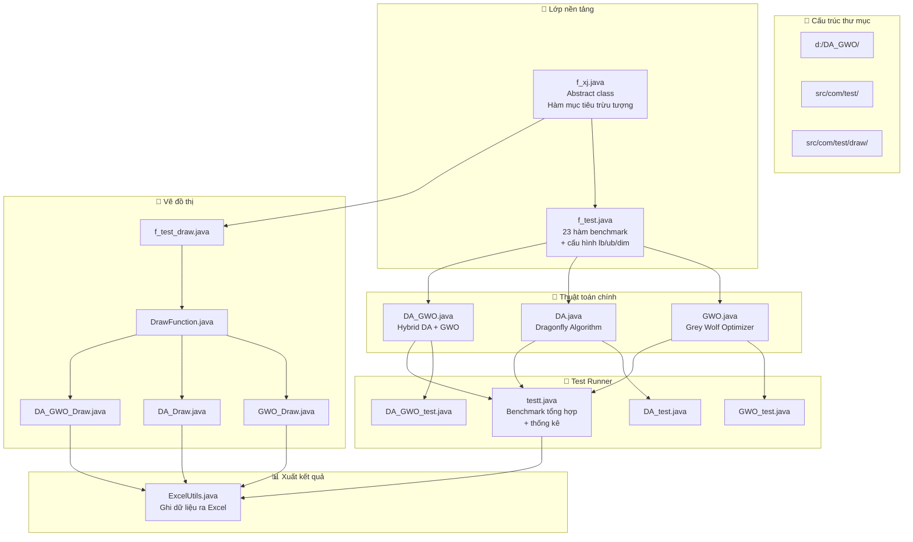
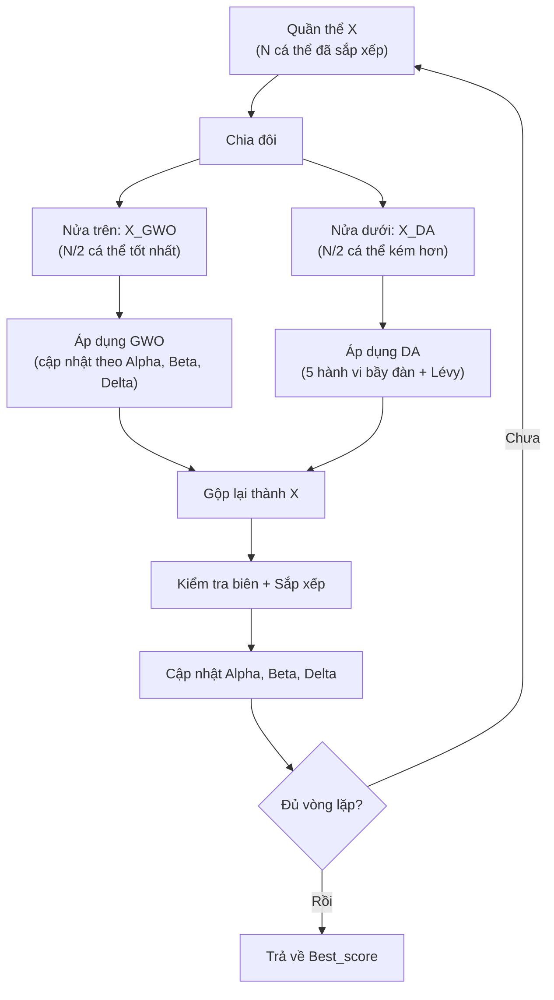
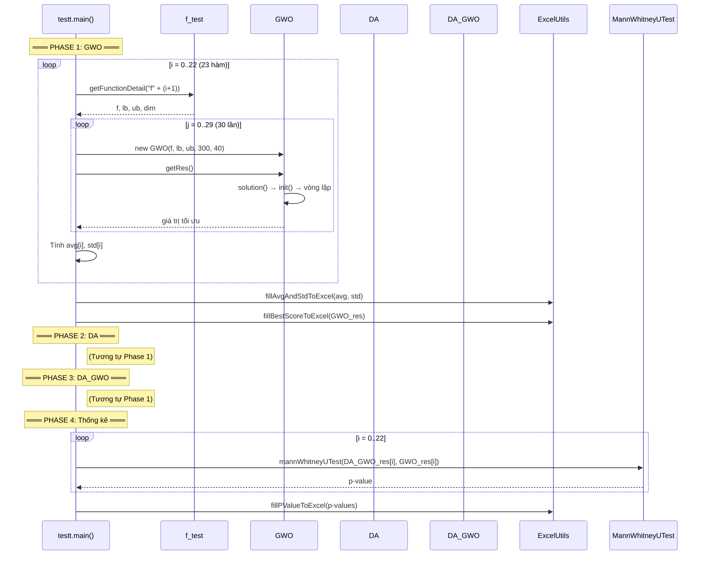
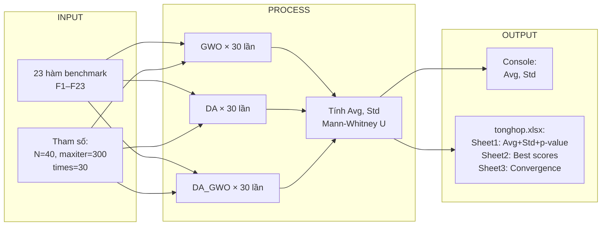

# 📖 PHÂN TÍCH TOÀN DIỆN DỰ ÁN DA_GWO

## Mục lục
1. [Tổng quan dự án](#1-tổng-quan-dự-án)
2. [Kiến trúc tổng thể](#2-kiến-trúc-tổng-thể)
3. [Giải thích thuật toán](#3-giải-thích-thuật-toán)
4. [Phân tích chi tiết từng file](#4-phân-tích-chi-tiết-từng-file)
5. [Luồng thực thi](#5-luồng-thực-thi)
6. [Dữ liệu đầu vào / đầu ra](#6-dữ-liệu-đầu-vào--đầu-ra)

---

## 1. Tổng quan dự án

### Dự án này là gì?

Đây là một dự án **Java** thực hiện và so sánh **3 thuật toán tối ưu hóa metaheuristic** (thuật toán siêu heuristic):

| Thuật toán | Tên đầy đủ | Lấy cảm hứng từ |
|---|---|---|
| **GWO** | Grey Wolf Optimizer | Hành vi săn mồi của bầy sói xám |
| **DA** | Dragonfly Algorithm | Hành vi bầy đàn của chuồn chuồn |
| **DA_GWO** | Hybrid DA + GWO | Kết hợp cả hai thuật toán trên |

### Mục đích

> **Tìm giá trị nhỏ nhất (minimum)** của các hàm toán học phức tạp (gọi là **benchmark functions**). Dự án kiểm thử trên **23 hàm benchmark chuẩn** (F1–F23) được sử dụng rộng rãi trong nghiên cứu tối ưu hóa.

### Thư viện bên ngoài

| Thư viện | Dùng cho |
|---|---|
| `apache-commons-math3` | Hàm Gamma (dùng trong Lévy flight), kiểm định Mann-Whitney U |
| `apache-poi` | Đọc/ghi file Excel (.xlsx) |

---

## 2. Kiến trúc tổng thể



### Phân loại file theo vai trò

| Vai trò | File | Mô tả |
|---|---|---|
| **Giao diện trừu tượng** | [f_xj.java](file:///d:/DA_GWO/src/com/test/f_xj.java) | Định nghĩa "hàm mục tiêu" là gì |
| **Hàm benchmark** | [f_test.java](file:///d:/DA_GWO/src/com/test/f_test.java) | 23 hàm kiểm thử F1–F23 |
| **Thuật toán GWO** | [GWO.java](file:///d:/DA_GWO/src/com/test/GWO.java) | Thuật toán Sói Xám |
| **Thuật toán DA** | [DA.java](file:///d:/DA_GWO/src/com/test/DA.java) | Thuật toán Chuồn Chuồn |
| **Thuật toán Lai** | [DA_GWO.java](file:///d:/DA_GWO/src/com/test/DA_GWO.java) | Thuật toán lai DA + GWO |
| **Test đơn** | [GWO_test.java](file:///d:/DA_GWO/src/com/test/GWO_test.java), [DA_test.java](file:///d:/DA_GWO/src/com/test/DA_test.java), [DA_GWO_test.java](file:///d:/DA_GWO/src/com/test/DA_GWO_test.java) | Chạy thử từng thuật toán |
| **Test tổng hợp** | [testt.java](file:///d:/DA_GWO/src/com/test/testt.java) | Chạy benchmark + thống kê + xuất Excel |
| **Tiện ích** | [ExcelUtils.java](file:///d:/DA_GWO/src/com/test/ExcelUtils.java) | Ghi dữ liệu ra file Excel |
| **Vẽ đồ thị** | [DrawFunction.java](file:///d:/DA_GWO/src/com/test/draw/DrawFunction.java) + 4 file khác | Phiên bản thu thập dữ liệu để vẽ biểu đồ |
| **Rỗng** | [lb_ub_test.java](file:///d:/DA_GWO/src/com/test/lb_ub_test.java) | Class rỗng (chưa hoàn thành) |

---

## 3. Giải thích thuật toán

### 3.1. GWO – Grey Wolf Optimizer (Thuật toán Sói Xám)

> [!NOTE]
> **Ý tưởng cốt lõi:** Mô phỏng cấu trúc xã hội và chiến thuật săn mồi của bầy sói xám.

#### Hệ thống phân cấp

```
🐺 Alpha (α) — Con sói tốt nhất — Lãnh đạo bầy đàn
🐺 Beta (β)  — Con sói tốt thứ 2 — Phó lãnh đạo
🐺 Delta (δ) — Con sói tốt thứ 3 — Cố vấn
🐺 Omega (ω) — Tất cả sói còn lại — Đi theo 3 con trên
```

#### Cơ chế hoạt động

**Bước 1: Khởi tạo** — Tạo N con sói ở vị trí ngẫu nhiên trong không gian tìm kiếm.

**Bước 2: Xếp hạng** — Tính giá trị hàm mục tiêu cho từng con sói, sắp xếp từ tốt nhất đến kém nhất → xác định Alpha, Beta, Delta.

**Bước 3: Cập nhật vị trí** — Mỗi con sói di chuyển theo công thức:

```
Với mỗi chiều j:
  A = 2·a·r₁ - a        (hệ số tấn công/khám phá)
  C = 2·r₂              (hệ số ngẫu nhiên)
  
  X₁ = α_j - A₁·|C₁·α_j - X_j|   (bước đi hướng Alpha)
  X₂ = β_j - A₂·|C₂·β_j - X_j|   (bước đi hướng Beta)
  X₃ = δ_j - A₃·|C₃·δ_j - X_j|   (bước đi hướng Delta)
  
  X_mới = (X₁ + X₂ + X₃) / 3      (trung bình 3 hướng)
```

**Bước 4: Giảm `a`** — Tham số `a` giảm tuyến tính từ 2 → 0 theo số vòng lặp:
- `a` lớn (gần 2) → `|A|` có thể > 1 → sói **khám phá** (exploration)
- `a` nhỏ (gần 0) → `|A|` luôn < 1 → sói **khai thác** (exploitation)

---

### 3.2. DA – Dragonfly Algorithm (Thuật toán Chuồn Chuồn)

> [!NOTE]
> **Ý tưởng cốt lõi:** Mô phỏng 5 hành vi bầy đàn của chuồn chuồn: Separation, Alignment, Cohesion, Food attraction, Enemy distraction.

#### 5 hành vi chính

| # | Hành vi | Ý nghĩa | Phương trình |
|---|---|---|---|
| 1 | **Separation (S)** | Tránh va chạm với các cá thể lân cận | Eq. 3.1 |
| 2 | **Alignment (A)** | Bay cùng hướng với các cá thể lân cận | Eq. 3.2 |
| 3 | **Cohesion (C)** | Bay về phía trung tâm bầy đàn | Eq. 3.3 |
| 4 | **Food attraction (F)** | Bay về phía con mồi (giá trị tốt nhất) | Eq. 3.4 |
| 5 | **Enemy distraction (E)** | Bay tránh kẻ thù (giá trị tệ nhất) | Eq. 3.5 |

#### Cơ chế cập nhật

```
Nếu có đủ hàng xóm:
  ΔX = s·S + a·A + c·C + f·F + e·E + w·ΔX_cũ
  X = X + ΔX

Nếu không có hàng xóm (cô đơn):
  X = X + Lévy(dim) · X     (bước nhảy Lévy ngẫu nhiên)
```

#### Lévy Flight (Eq. 3.10)

> Bước nhảy Lévy là bước đi ngẫu nhiên với chiều dài bước tuân theo phân phối Lévy — có nhiều bước ngắn và ít bước dài → giúp khám phá hiệu quả.

```
σ = [Γ(1+β)·sin(πβ/2) / (Γ((1+β)/2)·β·2^((β-1)/2))]^(1/β)
u = rand · σ
v = rand
step = 0.01 · u / |v|^(1/β)
```

#### Các trọng số thích ứng

```
w  = 0.9 - iter × (0.5/maxiter)     — Quán tính: giảm dần
my_c = 0.1 - iter × (0.1/(maxiter/2)) — Hệ số bầy đàn: giảm về 0
s, a, c = 2·rand·my_c               — Trọng số ngẫu nhiên × my_c
f = 2·rand                          — Trọng số con mồi
e = my_c                            — Trọng số kẻ thù
```

---

### 3.3. DA_GWO – Thuật toán lai

> [!IMPORTANT]
> **Ý tưởng cốt lõi:** Chia quần thể thành 2 nhóm. Nửa trên (tốt hơn) dùng GWO để khai thác. Nửa dưới (kém hơn) dùng DA để khám phá. Sau mỗi vòng, gộp lại và sắp xếp.



---

## 4. Phân tích chi tiết từng file

---

### 4.1. [f_xj.java](file:///d:/DA_GWO/src/com/test/f_xj.java) — Lớp trừu tượng hàm mục tiêu

```java
public abstract class f_xj {
    public abstract double func(double x[]) throws IOException;
}
```

| Thành phần | Giải thích |
|---|---|
| `abstract class f_xj` | Lớp trừu tượng — không thể tạo đối tượng trực tiếp, phải kế thừa |
| `abstract double func(double x[])` | Phương thức trừu tượng — nhận vào **mảng tọa độ** `x[]` (1 vị trí trong không gian), trả về **giá trị hàm** tại vị trí đó |

> **Ví dụ dễ hiểu:** Nếu bạn đang tìm đỉnh thấp nhất trên 1 ngọn núi, `x[]` là tọa độ (vĩ độ, kinh độ), còn `func(x)` trả về **độ cao** tại tọa độ đó. Mục tiêu là tìm `x[]` sao cho `func(x)` nhỏ nhất.

---

### 4.2. [f_test.java](file:///d:/DA_GWO/src/com/test/f_test.java) — 23 hàm benchmark

#### Biến static (cấu hình chung)

```java
public static String F_name = "f23";   // Tên hàm mặc định để test
public static int maxiter = 300;       // Số vòng lặp tối đa
public static int N = 40;             // Số lượng cá thể (quần thể)
```

#### Biến instance

```java
private f_xj f = null;   // Hàm mục tiêu hiện tại (1 trong 23 hàm)
private double lb;        // Cận dưới (lower bound) — giá trị nhỏ nhất cho mỗi chiều
private double ub;        // Cận trên (upper bound) — giá trị lớn nhất cho mỗi chiều  
private int dim;          // Số chiều (số biến) của hàm
```

#### Hàm `getFunctionDetail(String f_name)`

Nhận tên hàm (VD: `"f1"`, `"f15"`, `"f23"`), tạo đối tượng hàm tương ứng và thiết lập `lb`, `ub`, `dim`.

```java
switch (f_name) {
    case "f1":
        f = new f1();    // Tạo hàm Sphere
        lb = -100;       // Mỗi biến nằm trong [-100, 100]
        ub = 100;
        dim = 10;        // 10 biến
        break;
    // ... 22 case khác
}
```

#### Hàm `getLowerBound()` và `getUpperBound()`

Tạo mảng cận dưới/trên cho mỗi chiều (tất cả chiều có cùng giá trị lb/ub):

```java
public double[] getLowerBound() {
    double lb[] = new double[dim];  // Tạo mảng kích thước = số chiều
    for (int i = 0; i < dim; i++) {
        lb[i] = this.lb;            // Mỗi chiều cùng cận dưới
    }
    return lb;  // VD: [-100, -100, -100, ..., -100]
}
```

#### 23 hàm benchmark (inner class)

##### **Nhóm 1: Hàm Unimodal (F1–F7)** — Chỉ có 1 cực tiểu toàn cục, dùng để đánh giá khả năng **khai thác**.

| Hàm | Tên | Công thức | Min | Miền |
|---|---|---|---|---|
| **F1** | Sphere | `Σ(x_i²)` | 0 | [-100, 100] |
| **F2** | Schwefel 2.22 | `Σ|x_i| + Π|x_i|` | 0 | [-10, 10] |
| **F3** | Schwefel 1.2 | `Σ(Σx_j)²` | 0 | [-100, 100] |
| **F4** | Schwefel 2.21 | `max(|x_i|)` | 0 | [-100, 100] |
| **F5** | Rosenbrock | `Σ[100(x_{i+1}-x_i²)² + (1-x_i)²]` | 0 | [-30, 30] |
| **F6** | Step | `Σ|x_i+0.5|²` | 0 | [-100, 100] |
| **F7** | Quartic + noise | `Σ i·x_i⁴ + random` | ≈0 | [-1.28, 1.28] |

**Ví dụ F1 (Sphere) — Hàm đơn giản nhất:**

```java
class f1 extends f_xj {
    public double func(double x[]) {
        int n = x.length;       // Số chiều
        double f = 0;
        for (int i = 0; i < n; i++) {
            f = f + x[i] * x[i]; // Cộng dồn bình phương từng biến
        }
        return f;  // f(x) = x₁² + x₂² + ... + x_n²
        // Giá trị nhỏ nhất = 0, tại x = [0, 0, ..., 0]
    }
}
```

**Ví dụ F5 (Rosenbrock) — Hàm "thung lũng hoa hồng":**

```java
class f5 extends f_xj {
    public double func(double x[]) {
        int n = x.length;
        double ff = 0.0;
        for (int i = 0; i < n - 1; i++) {
            // 100·(x_{i+1} - x_i²)² + (1 - x_i)²
            ff += (100.0 * (x[i+1] - x[i]*x[i]) * (x[i+1] - x[i]*x[i])
                 + (1.0 - x[i]) * (1.0 - x[i]));
        }
        return ff;  // Min = 0 tại x = [1, 1, ..., 1]
    }
}
```

##### **Nhóm 2: Hàm Multimodal (F8–F13)** — Có rất nhiều cực tiểu địa phương, dùng để đánh giá khả năng **khám phá**.

| Hàm | Tên | Min |
|---|---|---|
| **F8** | Schwefel | ≈ -418.98×dim |
| **F9** | Rastrigin | 0 |
| **F10** | Ackley | 0 |
| **F11** | Griewank | 0 |
| **F12** | Penalized 1 | 0 |
| **F13** | Penalized 2 | 0 |

**Ví dụ F10 (Ackley):**

```java
class f10 extends f_xj {
    public double func(double x[]) {
        int n = x.length;
        double sum1 = 0, sum2 = 0;
        for (int i = 0; i < n; i++) {
            sum1 += x[i] * x[i];              // Tổng bình phương
            sum2 += Math.cos(2 * Math.PI * x[i]); // Tổng cosine
        }
        // Công thức Ackley:
        // -20·exp(-0.2·√(sum1/n)) - exp(sum2/n) + 20 + e
        return -20 * Math.exp(-0.2 * Math.sqrt(sum1 / n))
               - Math.exp(sum2 / n) + 20 + Math.E;
    }
}
```

##### **Nhóm 3: Hàm Fixed-dimension Multimodal (F14–F23)** — Số chiều cố định, cấu trúc phức tạp.

| Hàm | Tên | dim | Min |
|---|---|---|---|
| F14 | Shekel's Foxholes | 2 | ≈ 0.998 |
| F15 | Kowalik | 4 | ≈ 0.0003075 |
| F16 | Six-Hump Camel | 2 | ≈ -1.0316 |
| F17 | Branin | 2 | ≈ 0.398 |
| F18 | Goldstein-Price | 2 | 3 |
| F19 | Hartmann 3-D | 3 | ≈ -3.86 |
| F20 | Hartmann 6-D | 6 | ≈ -3.32 |
| F21–F23 | Shekel | 4 | ≈ -10.15, -10.40, -10.54 |

##### Lớp trợ giúp `UFun`

```java
static class UFun {
    // Hàm phạt (penalty function) — dùng cho F12 và F13
    public static double func(double x, double a, double k, double m) {
        if (x > a)       return k * Math.pow(x - a, m);   // x vượt cận trên → phạt
        else if (x < -a) return k * Math.pow(-x - a, m);  // x vượt cận dưới → phạt
        else             return 0;                         // x trong phạm vi → OK
    }
}
```

---

### 4.3. [GWO.java](file:///d:/DA_GWO/src/com/test/GWO.java) — Thuật toán Sói Xám

#### Tất cả biến (thuộc tính)

```java
// ===== Tham số ngẫu nhiên =====
double r1;         // Số ngẫu nhiên 1 (dùng tính A)
double r2;         // Số ngẫu nhiên 2 (dùng tính C)

// ===== Cấu hình =====
int N;             // Số lượng sói (quần thể)
int D;             // Số chiều (dimension = số biến)
int maxiter;       // Số vòng lặp tối đa

// ===== 3 con sói lãnh đạo =====
double alfa[];     // Vị trí con Alpha (tốt nhất) — mảng D phần tử
double beta[];     // Vị trí con Beta (tốt thứ 2)
double delta[];    // Vị trí con Delta (tốt thứ 3)

// ===== Biên =====
double Lower[];    // Cận dưới cho mỗi chiều
double Upper[];    // Cận trên cho mỗi chiều

// ===== Hàm mục tiêu =====
f_xj ff;           // Đối tượng hàm mục tiêu

// ===== Ma trận quần thể =====
double XX[][];     // Vị trí của tất cả N sói — Ma trận [N][D]
                   // XX[i][j] = vị trí sói thứ i tại chiều thứ j

// ===== Vị trí tạm =====
double X1;         // Vị trí tạm hướng về Alpha
double X2;         // Vị trí tạm hướng về Beta
double X3;         // Vị trí tạm hướng về Delta

// ===== Dữ liệu theo dõi =====
double fitness[];  // Giá trị hàm mục tiêu của mỗi sói
double BESTVAL[];  // Giá trị tốt nhất tại mỗi vòng lặp
double iterdep[];  // (không sử dụng)

// ===== Hệ số GWO =====
double a;          // Tham số giảm tuyến tính (2 → 0)
double A1, C1;     // Hệ số cho Alpha
double A2, C2;     // Hệ số cho Beta
double A3, C3;     // Hệ số cho Delta

// ===== Kết quả =====
double[][] Result;            // Kết quả: [0][0]=giá trị tối ưu, [1][]=vị trí tối ưu
double[][] arrRandomBestVal;  // Lịch sử vị trí tốt nhất mỗi vòng
```

#### Constructor — `GWO(f_xj iff, double iLower[], double iUpper[], int imaxiter, int iN)`

```java
public GWO(f_xj iff, double iLower[], double iUpper[], int imaxiter, int iN) {
    maxiter = imaxiter;     // Gán số vòng lặp tối đa
    ff = iff;               // Gán hàm mục tiêu
    Lower = iLower;         // Gán cận dưới
    Upper = iUpper;         // Gán cận trên
    N = iN;                 // Gán số lượng sói
    D = Upper.length;       // Số chiều = độ dài mảng cận trên
    XX = new double[N][D];  // Tạo ma trận quần thể
    alfa = new double[D];   // Khởi tạo vị trí Alpha
    beta = new double[D];   // Khởi tạo vị trí Beta
    delta = new double[D];  // Khởi tạo vị trí Delta
    BESTVAL = new double[maxiter];          // Lịch sử giá trị tốt nhất
    iterdep = new double[maxiter];
    arrRandomBestVal = new double[maxiter][D]; // Lịch sử vị trí tốt nhất
}
```

#### Hàm `sort_and_index(double[][] XXX)` — Sắp xếp quần thể theo fitness

```java
double[][] sort_and_index(double[][] XXX) throws IOException {
    // Bước 1: Tính giá trị hàm mục tiêu cho từng cá thể
    double[] yval = new double[N];
    for (int i = 0; i < N; i++) {
        yval[i] = ff.func(XXX[i]);  // yval[i] = f(sói thứ i)
    }

    // Bước 2: Sắp xếp giá trị fitness tăng dần
    ArrayList<Double> nfit = new ArrayList<>();
    for (int i = 0; i < N; i++) nfit.add(yval[i]);
    ArrayList<Double> nstore = new ArrayList<>(nfit); // Bản sao gốc
    Collections.sort(nfit);  // Sắp xếp tăng dần

    // Bước 3: Tìm chỉ số gốc của từng giá trị đã sắp xếp
    int[] indexes = new int[nfit.size()];
    for (int n = 0; n < nfit.size(); n++) {
        indexes[n] = nstore.indexOf(nfit.get(n));
        // indexes[0] = chỉ số của sói tốt nhất
    }

    // Bước 4: Sắp xếp lại ma trận quần thể theo thứ tự fitness
    double[][] B = new double[N][D];
    for (int i = 0; i < N; i++) {
        for (int j = 0; j < D; j++) {
            B[i][j] = XXX[indexes[i]][j]; // B[0] = sói tốt nhất
        }
    }
    return B;  // Trả về quần thể đã sắp xếp
}
```

> **Dễ hiểu:** Như xếp hạng 40 học sinh theo điểm thi, học sinh giỏi nhất đứng đầu.

#### Hàm `init()` — Khởi tạo quần thể

```java
void init() throws IOException {
    // Tạo N sói ở vị trí ngẫu nhiên
    for (int i = 0; i < N; i++) {
        for (int j = 0; j < D; j++) {
            // Vị trí = lb + (ub - lb) × random
            // VD: lb=-100, ub=100 → vị trí ngẫu nhiên trong [-100, 100]
            XX[i][j] = Lower[j] + (Upper[j] - Lower[j]) * Math.random();
        }
    }

    // Sắp xếp theo fitness
    XX = sort_and_index(XX);

    // Gán 3 con sói lãnh đạo
    for (int i = 0; i < D; i++) alfa[i] = XX[0][i];  // Tốt nhất
    for (int i = 0; i < D; i++) beta[i] = XX[1][i];  // Tốt thứ 2
    for (int i = 0; i < D; i++) delta[i] = XX[2][i]; // Tốt thứ 3
}
```

#### Hàm `simplebounds(double s[][])` — Kiểm tra và sửa biên

```java
double[][] simplebounds(double s[][]) {
    for (int i = 0; i < N; i++) {
        for (int j = 0; j < D; j++) {
            // Nếu vượt cận dưới hoặc cận trên → đặt lại ngẫu nhiên
            if (s[i][j] < Lower[j]) {
                s[i][j] = Lower[j] + ((Upper[j] - Lower[j]) * Math.random());
            }
            if (s[i][j] > Upper[j]) {
                s[i][j] = Lower[j] + ((Upper[j] - Lower[j]) * Math.random());
            }
        }
    }
    return s;
}
```

#### Hàm `solution()` — Vòng lặp chính ⭐

```java
double[][] solution() throws IOException {
    init();           // Khởi tạo quần thể
    int iter = 1;
    
    while (iter < maxiter) {
        // ① Giảm tuyến tính tham số a: 2 → 0
        a = 2.0 - ((double)iter * (2.0 / (double)maxiter));
        // Iter=1: a≈2.0 (khám phá), Iter=maxiter: a≈0 (khai thác)

        // ② Cập nhật vị trí từng sói
        for (int i = 0; i < N; i++) {
            for (int j = 0; j < D; j++) {
                // Bước đi hướng Alpha
                r1 = Math.random();  r2 = Math.random();
                A1 = 2.0 * a * r1 - a;    // A ∈ [-a, a]
                C1 = 2.0 * r2;            // C ∈ [0, 2]
                X1 = alfa[j] - A1 * (Math.abs(C1 * alfa[j] - XX[i][j]));
                // Nếu X1 vượt biên → tạo ngẫu nhiên
                if (X1 < Lower[j] || X1 > Upper[j])
                    X1 = Lower[j] + ((Upper[j] - Lower[j]) * Math.random());

                // Tương tự cho Beta và Delta...
                // (code tương tự cho A2, C2, X2 và A3, C3, X3)

                // Vị trí mới = trung bình 3 hướng
                XX[i][j] = (X1 + X2 + X3) / 3.0;
            }
        }

        // ③ Kiểm tra biên
        XX = simplebounds(XX);
        
        // ④ Sắp xếp lại quần thể
        XX = sort_and_index(XX);

        // ⑤ Thay sói cuối bằng sói tốt nhất (elitism)
        for (int i = 0; i < D; i++) XX[N-1][i] = XX[0][i];

        // ⑥ Cập nhật Alpha, Beta, Delta
        for (int i = 0; i < D; i++) alfa[i] = XX[0][i];
        for (int i = 0; i < D; i++) beta[i] = XX[1][i];
        for (int i = 0; i < D; i++) delta[i] = XX[2][i];

        // ⑦ Lưu giá trị tốt nhất
        BESTVAL[iter] = ff.func(XX[0]);
        arrRandomBestVal[iter] = XX[0];
        iter++;
    }

    // Trả về kết quả: out[0][0] = giá trị tối ưu, out[1][] = vị trí tối ưu
    double[][] out = new double[2][D];
    for (int i = 0; i < D; i++) out[1][i] = alfa[i];
    out[0][0] = ff.func(alfa);
    return out;
}
```

#### Các hàm khác của GWO

| Hàm | Chức năng |
|---|---|
| `execute()` | Gọi `solution()` và lưu kết quả vào `Result` |
| `toStringnew()` | In kết quả ra console |
| `getRes()` | Trả về giá trị tối ưu (chạy lại `solution()`) |
| `toStringNew(String)` | In kết quả với thông điệp tùy chỉnh |
| `getBestArray()` | Trả về vị trí tối ưu |
| `getArrayRandomResult()` | Trả về lịch sử vị trí tốt nhất mỗi vòng |

---

### 4.4. [DA.java](file:///d:/DA_GWO/src/com/test/DA.java) — Thuật toán Chuồn Chuồn

#### Tất cả biến

```java
double[] lb;              // Cận dưới cho mỗi chiều
double[] ub;              // Cận trên cho mỗi chiều
double[] r;               // Bán kính ảnh hưởng — xác định ai là "hàng xóm"
double[] Delta_max;       // Bước nhảy tối đa cho mỗi chiều
double Food_fitness;      // Giá trị hàm tại vị trí con mồi (giá trị tốt nhất hiện tại)
double[] Food_pos;        // Vị trí con mồi (vị trí tốt nhất)
double Enemy_fitness;     // Giá trị hàm tại vị trí kẻ thù (giá trị tệ nhất)
double[] Enemy_pos;       // Vị trí kẻ thù (vị trí tệ nhất)
double[][] X;             // Vị trí tất cả chuồn chuồn [SearchAgents_no][dim]
double[] Fitness;         // Giá trị hàm mục tiêu của mỗi chuồn chuồn
double[][] DeltaX;        // Bước nhảy (velocity) của mỗi chuồn chuồn
int dim;                  // Số chiều
int SearchAgents_no;      // Số lượng chuồn chuồn
int Max_iteration;        // Số vòng lặp tối đa
double inf = 10E+50;      // Giá trị "vô cùng" để khởi tạo
double Best_score;        // Kết quả tối ưu cuối cùng
double[] Best_pos;        // Vị trí tối ưu cuối cùng
f_xj fobj;                // Hàm mục tiêu
double[] randomm;         // Mảng số ngẫu nhiên (cho testing, hiện không dùng)
int position;             // Vị trí đọc trong mảng randomm
```

#### Hàm `init()` — Khởi tạo

```java
void init() {
    // ① Tính bước nhảy tối đa = 10% khoảng tìm kiếm
    for (int i = 0; i < dim; i++) {
        Delta_max[i] = (ub[i] - lb[i]) / 10;
        // VD: ub=100, lb=-100 → Delta_max = 20
    }

    // ② Tạo vị trí ngẫu nhiên cho mỗi chuồn chuồn
    for (int i = 0; i < SearchAgents_no; i++) {
        for (int j = 0; j < dim; j++) {
            X[i][j] = lb[j] + (ub[j] - lb[j]) * nextRand();
        }
    }

    // ③ Tạo bước nhảy ban đầu ngẫu nhiên
    for (int i = 0; i < SearchAgents_no; i++) {
        for (int j = 0; j < dim; j++) {
            DeltaX[i][j] = lb[j] + (ub[j] - lb[j]) * nextRand();
        }
    }
}
```

#### Hàm `solution()` — Vòng lặp chính ⭐

```java
void solution() throws IOException {
    init();
    
    for (int iter = 1; iter <= Max_iteration; iter++) {
        // ① Tính bán kính ảnh hưởng r — TĂNG DẦN theo vòng lặp
        for (int i = 0; i < dim; i++) {
            r[i] = (ub[i]-lb[i])/4 + ((ub[i]-lb[i]) * ((double)iter/Max_iteration) * 2);
            // Đầu: r nhỏ (ít hàng xóm → khám phá)
            // Cuối: r lớn (nhiều hàng xóm → khai thác)
        }

        // ② Tính trọng số quán tính w — GIẢM DẦN (0.9 → 0.4)
        double w = 0.9 - (double)iter * ((0.9 - 0.4) / Max_iteration);

        // ③ Tính hệ số bầy đàn my_c — GIẢM DẦN (0.1 → 0)
        double my_c = 0.1 - (double)iter * ((0.1) / ((double)Max_iteration/2));
        if (my_c < 0) my_c = 0;

        // ④ Tính trọng số cho 5 hành vi
        double s = 2 * nextRand() * my_c;   // Separation
        double a = 2 * nextRand() * my_c;   // Alignment
        double c = 2 * nextRand() * my_c;   // Cohesion
        double f = 2 * nextRand();           // Food attraction
        double e = my_c;                     // Enemy distraction

        // ⑤ Tính fitness + cập nhật Food và Enemy
        for (int i = 0; i < SearchAgents_no; i++) {
            Fitness[i] = fobj.func(X[i]);
            
            // Nếu tìm được giá trị tốt hơn → cập nhật Food (con mồi)
            if (Fitness[i] < Food_fitness) {
                Food_fitness = Fitness[i];
                Food_pos = X[i].clone();  // (code gốc copy thủ công)
            }
            
            // Nếu tìm được giá trị tệ hơn → cập nhật Enemy (kẻ thù)
            if (Fitness[i] > Enemy_fitness) {
                if (lt(X[i], ub) && gt(X[i], lb)) { // Chỉ nếu trong biên
                    Enemy_fitness = Fitness[i];
                    Enemy_pos = X[i].clone();
                }
            }
        }

        // ⑥ Cập nhật từng chuồn chuồn
        for (int i = 0; i < SearchAgents_no; i++) {
            // Tìm hàng xóm (trong bán kính r)
            // Tính S (separation), A (alignment), C (cohesion)
            // Tính F (food attraction), E (enemy distraction)
            
            if (any_gt(Dist2Food, r)) {
                // Con mồi xa → chế độ khám phá
                if (neighbours_no > 1) {
                    // Có hàng xóm: di chuyển theo bầy đàn
                    DeltaX = w*DeltaX + rand*A + rand*C + rand*S;
                    X = X + DeltaX;
                } else {
                    // Không có hàng xóm: nhảy Lévy
                    X = X + Lévy(dim) * X;
                }
            } else {
                // Con mồi gần → chế độ khai thác (dùng đủ 5 hành vi)
                DeltaX = a*A + c*C + s*S + f*F + e*Enemy + w*DeltaX;
                X = X + DeltaX;
            }
            
            // Giới hạn biên
            // ...
        }
        
        Best_score = Food_fitness;
        Best_pos = Food_pos;
    }
}
```

#### Các hàm so sánh vector

```java
boolean gt(x[], y[])     // x > y  (tất cả phần tử đều lớn hơn)
boolean lt(x[], y[])     // x < y  (tất cả phần tử đều nhỏ hơn)
boolean gte(x[], y[])    // x >= y
boolean lte(x[], y[])    // x <= y
boolean ne(x[], y[])     // x ≠ y  (tất cả phần tử đều khác nhau)
boolean equal(x[], y[])  // x == y
boolean any_gt(x[], y[]) // có bất kỳ x[i] > y[i] nào không?
```

#### Hàm `distance(double a[], double b[])` — Khoảng cách theo từng chiều

```java
double[] distance(double a[], double b[]) {
    double d[] = new double[a.length];
    for (int i = 0; i < a.length; i++) {
        d[i] = Math.sqrt((a[i]-b[i]) * (a[i]-b[i]));
        // = |a[i] - b[i]|  (giá trị tuyệt đối từng chiều)
    }
    return d;
}
```

> **Lưu ý:** Đây KHÔNG phải khoảng cách Euclid thông thường. Nó trả về **mảng khoảng cách trên từng chiều** (dùng để so sánh với bán kính `r` trên từng chiều).

#### Hàm `Levy(int d)` — Bước nhảy Lévy

```java
double[] Levy(int d) {
    double beta = 3.0 / 2.0;
    
    // Tính sigma theo Eq. 3.10
    double sigma = Math.pow(
        Gamma.gamma(1+beta) * Math.sin(Math.PI*beta/2) /
        (Gamma.gamma((1+beta)/2) * beta * Math.pow(2, (beta-1)/2)),
        1.0/beta
    );
    
    double[] u = new double[d];
    double[] v = new double[d];
    double[] step = new double[d];
    
    for (int i = 0; i < d; i++) {
        u[i] = nextRand() * sigma;      // Phân phối chuẩn × sigma
        v[i] = nextRand();               // Phân phối chuẩn
        step[i] = 0.01 * u[i] / Math.pow(Math.abs(v[i]), 1.0/beta);
    }
    return step;  // Bước nhảy Lévy
}
```

#### Hàm `nextRand()` và `readFile()`

```java
double nextRand() {
    return Math.random();  // Hiện dùng random thực sự
    // Trước đây có option đọc số ngẫu nhiên từ file (cho reproducibility)
}
```

---

### 4.5. [DA_GWO.java](file:///d:/DA_GWO/src/com/test/DA_GWO.java) — Thuật toán lai DA + GWO ⭐

#### Biến bổ sung so với DA

```java
double[][] X_GWO;   // Vị trí nửa quần thể dùng GWO
double[][] X_DA;     // Vị trí nửa quần thể dùng DA

// Biến GWO
double r1, r2;       // Số ngẫu nhiên
double alfa[];       // Vị trí Alpha
double beta[];       // Vị trí Beta
double delta[];      // Vị trí Delta
double A1, C1, A2, C2, A3, C3;  // Hệ số GWO
double a;            // Tham số giảm tuyến tính
double X1, X2, X3;  // Vị trí tạm
```

#### Hàm `solution()` — Vòng lặp chính ⭐

```java
void solution() throws IOException {
    init();  // Khởi tạo: Delta_max, X, DeltaX + sắp xếp + gán Alpha/Beta/Delta

    for (int iter = 1; iter <= Max_iteration; iter++) {
        
        // ═══════════════════════════════════════
        // BƯỚC 1: CHIA QUẦN THỂ THÀNH 2 NHÓM
        // ═══════════════════════════════════════
        int N_GWO = SearchAgents_no / 2;          // Nửa trên → GWO
        int N_DA = SearchAgents_no - N_GWO;       // Nửa dưới → DA
        
        // Copy nửa trên (tốt hơn) vào X_GWO
        for (int i = 0; i < N_GWO; i++)
            for (int j = 0; j < dim; j++)
                X_GWO[i][j] = X[i][j];
        
        // Copy nửa dưới (kém hơn) vào X_DA
        for (int i = N_GWO; i < SearchAgents_no; i++)
            for (int j = 0; j < dim; j++)
                X_DA[i - N_GWO][j] = X[i][j];

        // ═══════════════════════════════════════
        // BƯỚC 2: TÍNH FITNESS + CẬP NHẬT FOOD/ENEMY
        // ═══════════════════════════════════════
        // (Giống DA — cho TOÀN BỘ quần thể X)

        // ═══════════════════════════════════════
        // BƯỚC 3: ÁP DỤNG GWO CHO NỬA TRÊN
        // ═══════════════════════════════════════
        a = 2.0 - ((double)iter * (2.0 / (double)Max_iteration));
        for (int i = 0; i < N_GWO; i++) {
            for (int j = 0; j < dim; j++) {
                // Tính X1 (hướng Alpha), X2 (hướng Beta), X3 (hướng Delta)
                // X_GWO[i][j] = (X1 + X2 + X3) / 3.0
            }
        }

        // ═══════════════════════════════════════
        // BƯỚC 4: ÁP DỤNG DA CHO NỬA DƯỚI
        // ═══════════════════════════════════════
        // Tính r, w, my_c, s, a, c, f, e
        // Cho mỗi chuồn chuồn: tìm hàng xóm, tính S, A, C, F, E
        // Cập nhật DeltaX và X_DA

        // ═══════════════════════════════════════
        // BƯỚC 5: GỘP LẠI + SẮP XẾP
        // ═══════════════════════════════════════
        // Copy X_GWO → nửa trên của X
        // Copy X_DA → nửa dưới của X
        X = simplebounds(X, SearchAgents_no);  // Kiểm tra biên
        X = sort_and_index(X, SearchAgents_no); // Sắp xếp lại

        // Cập nhật Alpha, Beta, Delta
        for (int i = 0; i < dim; i++) alfa[i] = X[0][i];
        for (int i = 0; i < dim; i++) beta[i] = X[1][i];
        for (int i = 0; i < dim; i++) delta[i] = X[2][i];

        Best_score = fobj.func(X[0]);
        Best_pos = X[0];
    }
}
```

> [!TIP]
> **Tại sao nửa trên dùng GWO?** Vì các cá thể tốt đã ở gần vùng tối ưu, GWO giỏi **khai thác** (tập trung tìm kiếm quanh vùng tốt). Nửa dưới dùng DA vì DA giỏi **khám phá** (tìm vùng mới nhờ Lévy flight và hành vi bầy đàn).

---

### 4.6. [testt.java](file:///d:/DA_GWO/src/com/test/testt.java) — Chương trình benchmark tổng hợp

#### Biến static

```java
static double GWO_res[][] = new double[23][30];     // Kết quả GWO: 23 hàm × 30 lần chạy
static double DA_res[][] = new double[23][30];      // Kết quả DA
static double DA_GWO_res[][] = new double[23][30];  // Kết quả DA_GWO
static double pvalue_DAGWO_DA[] = new double[23];   // p-value so sánh DA_GWO vs DA
static double pvalue_DAGWO_GWO[] = new double[23];  // p-value so sánh DA_GWO vs GWO
static double pvalue_GWO_DA[] = new double[23];     // p-value so sánh GWO vs DA
static int times = 30;  // Số lần chạy mỗi hàm (để tính thống kê)
```

#### Hàm `main` — Điểm vào chương trình

```java
public static void main(String[] args) throws Exception {
    GWO(times);      // ① Chạy GWO cho 23 hàm × 30 lần → tính avg, std → ghi Excel
    DA(times);       // ② Chạy DA tương tự
    DA_GWO(times);   // ③ Chạy DA_GWO tương tự
    calPvalue();     // ④ Tính p-value Mann-Whitney U → ghi Excel
}
```

#### Hàm `GWO(int times)` (tương tự cho `DA` và `DA_GWO`)

```java
public static void GWO(int times) throws Exception {
    f_test f = new f_test();
    double avg[] = new double[23];  // Trung bình cho 23 hàm
    double std[] = new double[23];  // Độ lệch chuẩn cho 23 hàm
    
    for (int i = 0; i < 23; i++) {         // Lặp qua 23 hàm benchmark
        String fname = "f" + (i + 1);      // "f1", "f2", ..., "f23"
        f.getFunctionDetail(fname);         // Cấu hình hàm
        double f_optimize[] = new double[times];
        double sum = 0;
        
        for (int j = 0; j < times; j++) {  // Chạy 30 lần
            GWO result = new GWO(f.getF(), f.getLowerBound(), 
                                 f.getUpperBound(), f_test.maxiter, f_test.N);
            f_optimize[j] = result.getRes();    // Lấy giá trị tối ưu
            GWO_res[i][j] = f_optimize[j];      // Lưu kết quả
            sum += f_optimize[j];
        }

        avg[i] = sum / times;  // Trung bình = tổng / số lần

        // Tính độ lệch chuẩn (standard deviation)
        for (int j = 0; j < times; j++) {
            std[i] += (f_optimize[j] - avg[i]) * (f_optimize[j] - avg[i]);
        }
        std[i] /= (times - 1);       // Phương sai mẫu
        std[i] = Math.sqrt(std[i]);   // Căn bậc 2 → độ lệch chuẩn
    }
    
    // Ghi kết quả ra Excel
    ExcelUtils.fillAvgAndStdToExcel(f_test.N, f_test.maxiter, times, avg, std, 0);
    ExcelUtils.fillBestScoreToExcel(GWO_res, 23, times, 0);
}
```

#### Hàm `calPvalue()` — Kiểm định thống kê

```java
static void calPvalue() throws IOException {
    MannWhitneyUTest mannWhitneyUTest = new MannWhitneyUTest();
    // Mann-Whitney U Test: kiểm định phi tham số
    // → Xác định 2 thuật toán có khác biệt đáng kể hay không
    
    for (int i = 0; i < 23; i++) {
        // So sánh DA_GWO vs GWO
        pvalue_DAGWO_GWO[i] = mannWhitneyUTest.mannWhitneyUTest(
            DA_GWO_res[i], GWO_res[i]);
        // p-value < 0.05 → khác biệt có ý nghĩa thống kê
        
        // Tương tự cho DA_GWO vs DA, GWO vs DA
    }
    
    ExcelUtils.fillPValueToExcel(pvalue_DAGWO_DA, pvalue_DAGWO_GWO, pvalue_GWO_DA, 23);
}
```

> **Dễ hiểu:** Giống như chạy 2 đội thi 30 lần, rồi dùng phương pháp thống kê để kết luận đội nào giỏi hơn (không phải do may mắn).

---

### 4.7. [ExcelUtils.java](file:///d:/DA_GWO/src/com/test/ExcelUtils.java) — Ghi dữ liệu ra Excel

#### 4 hàm static

| Hàm | Mục đích | Ghi vào |
|---|---|---|
| `fillAvgAndStdToExcel(...)` | Ghi Avg + Std của 23 hàm | Sheet1, hàng 9–31 |
| `fillBestScoreToExcel(...)` | Ghi 30 giá trị best score cho mỗi hàm | Sheet2 |
| `fillPValueToExcel(...)` | Ghi p-value so sánh 3 cặp thuật toán | Sheet1, hàng 38–60 |
| `fillForDrawFunctionToExcel(...)` | Ghi F_min, F_avg, X_1, X_2 theo vòng lặp | Sheet3 |

**Ví dụ `fillAvgAndStdToExcel`:**

```java
public static void fillAvgAndStdToExcel(int N, int max_iteration, int times,
                                         double avg[], double std[], int startColumn) {
    // Mở file Excel
    String excelFilePath = "C:\\Users\\HOANG\\Desktop\\GWO\\tonghop.xlsx";
    Workbook workbook = new XSSFWorkbook(new FileInputStream(excelFilePath));
    Sheet sheet = workbook.getSheet("Sheet1");

    // Ghi thông tin cấu hình
    sheet.getRow(2).getCell(1).setCellValue("N = " + N);           // Số cá thể
    sheet.getRow(3).getCell(1).setCellValue("Max iteration = " + max_iteration);
    sheet.getRow(4).getCell(1).setCellValue(times + " times");     // Số lần chạy

    // Ghi avg và std cho 23 hàm
    for (int i = 0; i < 23; i++) {
        Row row = sheet.getRow(9 + i);
        row.getCell(1 + startColumn).setCellValue(avg[i]);   // Cột avg
        row.getCell(2 + startColumn).setCellValue(std[i]);   // Cột std
    }
    
    // Lưu file
    workbook.write(new FileOutputStream(excelFilePath));
}
```

> [!WARNING]
> File Excel path được hardcode: `C:\Users\HOANG\Desktop\GWO\tonghop.xlsx`. Bạn cần thay đổi đường dẫn này nếu chạy trên máy khác.

---

### 4.8. Test Runner đơn giản

#### [GWO_test.java](file:///d:/DA_GWO/src/com/test/GWO_test.java)

```java
public class GWO_test {
    public static void main(String args[]) throws Exception {
        f_test f = new f_test();
        f.getFunctionDetail("f1");   // Dùng hàm Sphere
        
        // Tạo GWO với: hàm f1, biên [-100,100], 300 vòng, 40 cá thể
        GWO result = new GWO(f.getF(), f.getLowerBound(), 
                             f.getUpperBound(), f_test.maxiter, f_test.N);
        
        long startTime = System.currentTimeMillis();
        result.toStringnew();  // Chạy + in kết quả
        long endTime = System.currentTimeMillis();
        
        System.out.println((endTime - startTime) / 1000.0 + " sec");
    }
}
```

[DA_test.java](file:///d:/DA_GWO/src/com/test/DA_test.java) và [DA_GWO_test.java](file:///d:/DA_GWO/src/com/test/DA_GWO_test.java) hoạt động tương tự, dùng `f_test.F_name` (mặc định `"f23"`).

---

### 4.9. Package `draw/` — Phiên bản vẽ đồ thị

Các file trong thư mục [draw/](file:///d:/DA_GWO/src/com/test/draw) là **bản sao** của các thuật toán chính, được bổ sung thêm:

| Biến bổ sung | Ý nghĩa |
|---|---|
| `F_min[]` | Giá trị tốt nhất tại mỗi vòng lặp (convergence curve) |
| `F_avg[]` | Giá trị trung bình của quần thể mỗi vòng |
| `X_1[]` | Giá trị x₁ của search agent đầu tiên mỗi vòng |
| `X_2[]` | Giá trị x₂ của search agent đầu tiên mỗi vòng |

Dữ liệu này được ghi vào Excel Sheet3 để **vẽ biểu đồ hội tụ** (convergence curve) và **quỹ đạo di chuyển** (trajectory).

#### [DrawFunction.java](file:///d:/DA_GWO/src/com/test/draw/DrawFunction.java) — Điều phối vẽ

```java
public static void main(String[] args) throws Exception {
    for (int i = 0; i < 23; i++) {          // Chạy 23 hàm
        // Chạy GWO_Draw → ghi F_min vào Excel Sheet3 hàng 5
        // Chạy DA_Draw  → ghi F_min vào Excel Sheet3 hàng 34
        // Chạy DA_GWO_Draw → ghi F_min vào Excel Sheet3 hàng 63
    }
}
```

#### [f_test_draw.java](file:///d:/DA_GWO/src/com/test/draw/f_test_draw.java)

Giống `f_test.java` nhưng:
- `maxiter = 100` (ít hơn, để vẽ nhanh)
- `N = 6` (ít cá thể hơn, để vẽ quỹ đạo rõ ràng)
- Mỗi hàm dùng `x.length - 1` thay vì `x.length` (vì mảng X có thêm 1 cột đánh dấu)

---

## 5. Luồng thực thi

### 5.1. Luồng chính (testt.java)



### 5.2. Luồng bên trong GWO.solution()

```
Khởi tạo: Tạo N sói ngẫu nhiên → Sắp xếp → Gán Alpha/Beta/Delta
│
└──► Vòng lặp (iter = 1 → maxiter):
     │
     ├── ① Giảm a: 2 → 0
     │
     ├── ② Với mỗi sói i, mỗi chiều j:
     │   ├── Tính A₁,C₁ → X₁ (theo Alpha)
     │   ├── Tính A₂,C₂ → X₂ (theo Beta)
     │   ├── Tính A₃,C₃ → X₃ (theo Delta)
     │   └── XX[i][j] = (X₁+X₂+X₃)/3
     │
     ├── ③ Kiểm tra biên (simplebounds)
     ├── ④ Sắp xếp lại (sort_and_index)
     ├── ⑤ Thay sói cuối = sói đầu (elitism)
     └── ⑥ Cập nhật Alpha, Beta, Delta
```

### 5.3. Luồng bên trong DA_GWO.solution()

```
Khởi tạo: Delta_max + X + DeltaX + Sắp xếp + Alpha/Beta/Delta
│
└──► Vòng lặp (iter = 1 → Max_iteration):
     │
     ├── ① CHIA: X → X_GWO (nửa trên) + X_DA (nửa dưới)
     │
     ├── ② TÍNH FITNESS: cho toàn bộ X
     │   ├── Cập nhật Food (giá trị tốt nhất)
     │   └── Cập nhật Enemy (giá trị tệ nhất)
     │
     ├── ③ GWO: Cập nhật X_GWO (N/2 cá thể tốt nhất)
     │   └── X_GWO[i][j] = (X1+X2+X3)/3  (theo Alpha,Beta,Delta)
     │
     ├── ④ DA: Cập nhật X_DA (N/2 cá thể kém hơn)
     │   ├── Tìm hàng xóm → tính S, A, C, F, Enemy
     │   └── Cập nhật DeltaX + X_DA (hoặc Lévy nếu cô đơn)
     │
     ├── ⑤ GỘP: X = X_GWO ∪ X_DA
     ├── ⑥ Kiểm tra biên + Sắp xếp
     └── ⑦ Cập nhật Alpha, Beta, Delta + Best_score
```

---

## 6. Dữ liệu đầu vào / đầu ra

### 6.1. Đầu vào

| Tham số | Giá trị mặc định | Ý nghĩa |
|---|---|---|
| `f_test.N` | 40 | Số lượng cá thể trong quần thể |
| `f_test.maxiter` | 300 | Số vòng lặp tối đa |
| `testt.times` | 30 | Số lần chạy lặp lại (cho thống kê) |
| `lb`, `ub` | Tùy hàm | Cận dưới/trên không gian tìm kiếm |
| `dim` | Tùy hàm (2–10) | Số chiều (số biến) |

### 6.2. Đầu ra

#### Console output (khi chạy `testt`)
```
Fname: f1
Avg = 1.234E-10
Std = 5.678E-11
Fname: f2
Avg = ...
...
Write to excel done!
```

#### File Excel (`tonghop.xlsx`)

| Sheet | Nội dung |
|---|---|
| **Sheet1** | Avg + Std + p-value cho 23 hàm × 3 thuật toán |
| **Sheet2** | 30 giá trị best score cho mỗi hàm × 3 thuật toán |
| **Sheet3** | F_min theo vòng lặp (dữ liệu vẽ convergence curve) |

### 6.3. Sơ đồ dữ liệu



---

## Tổng kết

| Câu hỏi | Trả lời |
|---|---|
| **Dự án làm gì?** | So sánh 3 thuật toán tối ưu hóa: GWO, DA, và hybrid DA_GWO |
| **Thuật toán nào mới?** | DA_GWO — kết hợp GWO (khai thác) và DA (khám phá) |
| **Kiểm thử như thế nào?** | 23 hàm benchmark chuẩn, mỗi hàm chạy 30 lần |
| **Đánh giá bằng gì?** | Trung bình (Avg), độ lệch chuẩn (Std), p-value Mann-Whitney |
| **Kết quả ở đâu?** | File Excel `tonghop.xlsx` với 3 sheet |
| **Ngôn ngữ?** | Java, dùng IntelliJ IDEA |
| **Thư viện?** | Apache Commons Math + Apache POI |
